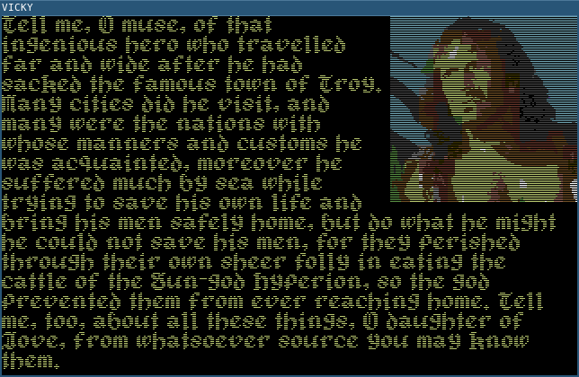

## 9/2/2018 Unrolling

Due to the fact that the previous 'improvement' slowed things down somewhat, I decided to profile the code and see if there were any obvious performance bottlenecks. I added a simple profiler that looked for execution hotspots and looked at the output. No surprise the text rendering code was the biggest glutton for CPU. Since 6502 can only shift one bit at a time and I have variable bit width text, it is quite expensive to get even once character on screen.

Code like this executes for every single line of every single character rendered to the screen. That's a lot.

~~~~
	;each character
	LDX.ZP :shift
	...
	;each row of each character
:rotate ASL
        DEX
        BNE :rotate
~~~~

A self-modifying code trick can be used to unroll this loop and get the right number of shifts without having to pay the 5 cycles for the DEX and the BNE.

~~~~
	;each character
	LDA.ZP :shift
	EOR #XFF
	ADC #X9
	STA.AB :rotate + 1
	...
	;each row of each character
:rotate BNE XX --+
	ASL      |
        ASL      |
	ASL      |
	ASL <----+
	ASL
	ASL
	ASL
	ASL
~~~~

5 cycles doesn't sound like a lot, it's only 5 micro-seconds at 1Mhz, but in all it saved about 80 milliseconds when rendering the dungeon room.

Another more straightfoward unrolling of loops has been added to the memset and memcpy routines. Additionally the Huffman decoder has had the hi byte of the offset removed. Since we have less than 256 symbols, it isn't necessary as the result always fits into the lo byte. Total savings, > 100ms. Not quite back to where we were, but almost.

~~~~
CL-USER> (run-simple-game)
Dungeon Cell size 3146
Corridor size 1928
Frazbolg's Closet size 1322
Object Table size 154
Dispatcher size 337
String Table size 902
Fonts size 2321
Build size 13721 (cf 13681)
Cycles:550324 (cf 548029)
~~~~

100ms saving has cost us 40 bytes on the build size. Well worth it. Of course, I could have applied these improvements to the old version...

## 9/2/2018 Huffman a go-go

So the game has been ported to use Huffman encoding for the strings rather than the Tunstall table of common two and three letter symbols. Let us see what effect this has had,

~~~~
CL-USER> (run-simple-game)
Dungeon Cell size 2951
Corridor size 1881
Frazbolg's Closet size 1322
Object Table size 154
Dispatcher size 337
String Table size 813
Fonts size 2321
Build size 13681
Cycles:548029
~~~~

And the Huffman encoded version,

~~~~
CL-USER> (run-simple-game)
Dungeon Cell size 3146
Corridor size 1928
Frazbolg's Closet size 1322
Object Table size 154
Dispatcher size 337
String Table size 912
Fonts size 2321
Build size 13548
Cycles:651045
~~~~

So, worse on every metric except one, total build size. Build size has been reduced as we no longer need to store the Tunstall table. I can't say I'm not slightly disappointed but we now have our ducks in a line for the massive gainz I have been thinking about, namely,

- Better image compression
- Common word dictionary
- Higher order prediction

### Cycle Proficiency

I have added the 6502 cycle time to the monitor- now I can see just how long each operation is taking. To render the dungeon cell location, image and text included is taking about 650ms (assuming a 1Mhz processor). As far as I remember this is quick for an 8 bit adventure game. Input responses are much quicker at approximately 100ms.

## 7/2/2018 Efficient Huffman Decoding in 8 bits

After wading through Wikipedia and various other online resources I have finally managed to implement a Huffman code decoder in 6502.

### Building the tree

For my project, I am generating everything using LISP. We start by taking a bunch of strings and analysing the frequencies of the characters,

~~~~
SPC 38    e    17    t    14    a    14    i    12  o    11    n    11    s     8
l    8    h     8    d     7    EOS   6    m     5  c     5    r     4    k     4
f    4    u     3    p     3    g     3    y     2  x     2    b     2    T     2
S    2    '     2    z     1    w     1    q     1  I     1    ?     1    ,     1 
~~~~

Generate the Huffman tree in the normal fashion,

- Make a list of the symbols, lowest frequency first
- Take the two least frequent items, A and B
- Join them together to make a new node with frequency freq(A)+freq(B)
- Insert this node into the list at the right place
- Repeat until you have a tree

A slightly more efficient approach puts the new nodes into a second list, but efficiency in the encoding stage is not a concern here.

Once we have the tree we label all the symbols with their depth.

~~~~
0                                   *
                                   / \
                                  /   \
                                 /     \
                                /       \
                               /         \
1                             *           *
                             / \         / \
2                           *   *       *   SPC
                           / \ / \ 
3                         e  t a  i                          
~~~~

It is clear that we can construct a code by emitting 1s and 0s as we descend down either of the branches of the tree. To decode we can write some code that reads bits, descends down the branches of the tree and emits a character when it reaches a leaf.

~~~~
  0   len:2    16 r len:6
  1 e len:4    17 g len:6
  2 a len:4    18 p len:6
  3 t len:4    19 u len:6
  4 i len:4    20 ' len:7
  5 n len:4    21 S len:7
  6 o len:4    22 T len:7
  7 h len:5    23 b len:7
  8 l len:5    24 x len:7
  9 s len:5    25 y len:7
 10 d len:5    26 , len:7
 11 * len:5    27 ? len:7
 12 c len:5    28 I len:8
 13 m len:6    29 q len:8
 14 f len:6    30 w len:8
 15 k len:6    31 z len:8 
~~~~

However, it is less clear that there are a number of codes that exist with the symbols encoded at the same depth. This can be seen by the fact that we are free to reflect the nodes from left to right as we desire (e.g. we could swap *e* and *t* and the code would be essentially unchanged).

### Canonical Code

We can construct a so called canonical code which satisfies the following three properties.

- Same code lengths as the original tree
- Code prefixes follow a strict ordering
- Codes of same length are consecutive

It wasn't until I had successfully constructed the canonical code that I was able to see the last two properties, so here are the canonical codes. They are generated by starting at 0, incrementing by one for each new symbol and when we go up to a new length, shifting by 1 bit per level.

~~~~
 # | |length| code, left shifted   |  decimal code
---|-|------|----------------------|---------------
  0   len:2   bits:0000000000000000  0
  1 e len:4   bits:0100000000000000  4
  2 a len:4   bits:0101000000000000  5
  3 t len:4   bits:0110000000000000  6
  4 i len:4   bits:0111000000000000  7
  5 n len:4   bits:1000000000000000  8
  6 o len:4   bits:1001000000000000  9
  7 h len:5   bits:1010000000000000  20
  8 l len:5   bits:1010100000000000  21
  9 s len:5   bits:1011000000000000  22
 10 d len:5   bits:1011100000000000  23
 11 * len:5   bits:1100000000000000  24
 12 c len:5   bits:1100100000000000  25
 13 m len:6   bits:1101000000000000  52
 14 f len:6   bits:1101010000000000  53
 15 k len:6   bits:1101100000000000  54
 16 r len:6   bits:1101110000000000  55
 17 g len:6   bits:1110000000000000  56
 18 p len:6   bits:1110010000000000  57
 19 u len:6   bits:1110100000000000  58
 20 ' len:7   bits:1110110000000000  118
 21 S len:7   bits:1110111000000000  119
 22 T len:7   bits:1111000000000000  120
 23 b len:7   bits:1111001000000000  121
 24 x len:7   bits:1111010000000000  122
 25 y len:7   bits:1111011000000000  123
 26 , len:7   bits:1111100000000000  124
 27 ? len:7   bits:1111101000000000  125
 28 I len:8   bits:1111110000000000  252
 29 q len:8   bits:1111110100000000  253
 30 w len:8   bits:1111111000000000  254
 31 z len:8   bits:1111111100000000  255
~~~~

The strict ordering criteria means that, for example, all 6 bit codes have a 5 bit prefix which is greater than *all* 5 bit codes, all 5 bit codes have a prefix greater than *all* 4 bit codes.

This is where the details online are a bit thin on the ground, and are mostly concerned with compact storage of the tree from an information theory point of view, but essentially the entire code can be reconstructed by simply storing the following table.

~~~~
Code Length | # Symbols | Lowest Code
------------+-----------+------------
1           | 0         | nil
2           | 1         | 0
3           | 0         | nil
4           | 6         | 4
5           | 6         | 20
6           | 7         | 52
7           | 8         | 118
8           | 4         | 252
~~~~

We can read the bits in, and check at each level if the code is within the range, e.g. if we read in 4 bits `1010` which is 10, we can see that it is not within the range for the 4 bit codes, so we read another bit. Let's say we get a 1, `10101` which is 21, we can see that it is within the range for the 5 bit codes, and we can use arithmetic to calculate the symbol index.

To implement this in 6502, we don't want to do any calculations we don't need to, so we store a slightly different table than the one encountered in most of the tutorials. Instead of storing the lowest code for symbols of a particular length, we store the maximum. Now we can do a simple compare rather than a subtract and compare. In addition, we store the offset needed to translate from code to index. This means we do not need to keep a running tally of the number of symbols at each depth.

~~~~
L  | Max | Delt
---+-----+-----
1  | NIL | NIL
2  |   0 |   0
3  | NIL | NIL
4  |   9 |   3
5  |  25 |  13
6  |  58 |  39
7  | 125 |  98
8  | 255 | 224
~~~~

Let us say we have read 5 bits `10100`. First we see that it its value (20) is less than 25, so it must be a 5 bit symbol. We don't need to read any more bits. We now simply take 20 and subtract the value in the Delt column, 13 giving 6, which is the index of the letter `h`. As you can see from the code table above, this is the correct decoding.

Actually storing this table is simple. For each empty row (e.g. there are no 3 bit codes) store a `$00`. For a populated row we store a `$FF`, the Max value in hi-byte lo-byte order then the Delt value in lo-byte hi-byte order. These orderings make the comparison and subtraction simpler.

Finally here is the implementation. Note that we do not have to traverse the entire code table to find the codes. Additionally, there are only three shift instructions.

~~~~
        HUFFMAN-NEXT 070E A000     LDY #$00
                     0710 840C     STY $0C   ;clear accumulator
                     0712 840D     STY $0D
                     0714 88       DEY       ;Start at zero in pop table, following the first INY
   DECODER:FETCH-BIT 0715 C605     DEC $05
                     0717 D014     BNE $072D ;DECODER:GOT-BITS 
                     ;New byte required
                     ;Save our pop table index
                     0719 98       TYA
                     071A AA       TAX
                     071B A000     LDY #$00
                     071D B103     LDA ($03),Y
                     071F 850E     STA $0E
                     0721 E603     INC $03   ;PTR
                     0723 D002     BNE $0727 ;L1:INC16-DONE 
                     0725 E604     INC $04   ;PTR + 1
       L1:INC16-DONE 0727 A908     LDA #$08
                     0729 8505     STA $05
                     ;Restore the pop table index
                     072B 8A       TXA
                     072C A8       TAY
                     ;Lets rotate a bit from the next byte
                     ;into the accumulator
    DECODER:GOT-BITS 072D 060E     ASL $0E
                     072F 260D     ROL $0D
                     0731 260C     ROL $0C
                     0733 C8       INY
                     0734 B101     LDA ($01),Y ;Any symbols at this length?
                     0736 F0DD     BEQ $0715 ;DECODER:FETCH-BIT 
                     0738 C8       INY       ;Skip row indicator byte
                     ;We have some symbols- does the accumulator hold one?
                     ;It does if the accumulator is less than the max-code
                     ;for codes of this length. So let's compare it.
                     0739 B101     LDA ($01),Y
                     073B C50C     CMP $0C
                     073D 3014     BMI $0753 ;DECODER:GT1  ;acc-hi > max-code(len)-hi
                     073F C8       INY
                     0740 B101     LDA ($01),Y
                     0742 C50D     CMP $0D
                     0744 300E     BMI $0754 ;DECODER:GT2  ;acc-lo > max-code(len)-lo
                     0746 C8       INY
                     ;Now acc<=max-code(len), this means we have a symbol woo!
                     ;To get the symbol index we subtract the offset
                     ;which has kindly been pre-computed in the pop table
                     0747 38       SEC
                     0748 A50D     LDA $0D
                     074A F101     SBC ($01),Y ;- offset lo
                     074C AA       TAX
                     074D C8       INY
                     074E A50C     LDA $0C
                     0750 F101     SBC ($01),Y ;- offset hi
                     ;Return to caller with index-hi in A and index-lo in X
                     0752 60       RTS
                     ;Skip rest of row and get next bit
         DECODER:GT1 0753 C8       INY
         DECODER:GT2 0754 C8       INY
                     0755 C8       INY
                     0756 D0BD     BNE $0715 ;DECODER:FETCH-BIT 
                     ;String Table
                     ;General strings huffman population
                     ;0 symbols of length 1
                     ;Max Code: NIL Offset: NIL
    STRING-POP-TABLE 0758 00       DB $00
                     ;1 symbols of length 2
                     ;Max Code: 0000 Offset: 0000
                     0759 FF0000.. DB $FF, $00, $00, $00, $00
                     ;0 symbols of length 3
                     ;Max Code: NIL Offset: NIL
                     075E 00       DB $00
                     ;6 symbols of length 4
                     ;Max Code: 0009 Offset: 0003
                     075F FF0009.. DB $FF, $00, $09, $03, $00
                     ;6 symbols of length 5
                     ;Max Code: 0019 Offset: 000D
                     0764 FF0019.. DB $FF, $00, $19, $0D, $00
                     ;7 symbols of length 6
                     ;Max Code: 003A Offset: 0027
                     0769 FF003A.. DB $FF, $00, $3A, $27, $00
                     ;8 symbols of length 7
                     ;Max Code: 007D Offset: 0062
                     076E FF007D.. DB $FF, $00, $7D, $62, $00
                     ;4 symbols of length 8
                     ;Max Code: 00FF Offset: 00E0
                     0773 FF00FF.. DB $FF, $00, $FF, $E0, $00
                 END 0778 00       BRK       ;HUFFMAN-PTR ;HUFFMAN-PTR + 1
~~~~

## 5/2/2018 Decompression Chamber

I return from the depths of the entropy mines bearing good and bad news. Given that there are to be twenty-four rooms in the game I plan for the competition, and that each room was running to 3k, I decided to investigate better compression schemes. 40K is probably about the maximum size, as clearly Kevin will want to port the game to Z80 and have it running in all the garish colours the ZX Spectrum affords.

## LZ style dictionaries

They are expensive! LZ style dictionaries are built up in memory as the compressor (and decompressor) runs along the input, then discarded. We can't afford to build any dictionaries at run time so we have to statically allocate them in memory. It is not clear where the break even point is, and my test game certainly wasn't large enough to show a break even.

My experiments showed compression rates down to just less than 3k- realistically I think another 30% was possible with a large dictionary, but at huge cost. There were also some extremely counter-intuitive results, for example, for total size of strings and tables, small words were preferable, with the best performer (for the simple game) being word size 1! One thing I have learned from this is that when it comes to data compression you *must* do experiments. I would have bet real money the compression would have increased with word size. Meh, perhaps my experimental code was just crummy. Either way, the numbers don't lie and everything being equal, for *total cost of ownership* the Tunstall table is pretty damn good, and I decided it wasn't worth commiting to a dictionary scheme yet.

## Huffman coding

Huffman coding was used to generate variable length bit codes to store the strings. Now, Huffman gives pretty similar compression ratio to the Tunstall table, but the cost is minimal. Surprisingly there is a thing called the canonical Huffman code, which is an additional ordering on the codes. It has the property that it can be described by a very small table. So, here is an example set of Huffman codes. Notice the total ordering in both the length and the bit pattern. Notice also how the bit patterns, for a given length, are consecutive.

~~~~

  0   len:2   bits:0000000000000000 0
  1 e len:4   bits:0100000000000000 4
  2 a len:4   bits:0101000000000000 5
  3 t len:4   bits:0110000000000000 6
  4 i len:4   bits:0111000000000000 7
  5 n len:4   bits:1000000000000000 8
  6 o len:4   bits:1001000000000000 9
  7 h len:5   bits:1010000000000000 20
  8 l len:5   bits:1010100000000000 21
  9 s len:5   bits:1011000000000000 22
 10 d len:5   bits:1011100000000000 23
 11 * len:5   bits:1100000000000000 24 <- End Marker
 12 c len:5   bits:1100100000000000 25
 13 m len:6   bits:1101000000000000 52
 14 f len:6   bits:1101010000000000 53
 15 k len:6   bits:1101100000000000 54
 16 r len:6   bits:1101110000000000 55
 17 g len:6   bits:1110000000000000 56
 18 p len:6   bits:1110010000000000 57
 19 u len:6   bits:1110100000000000 58
 20 ' len:7   bits:1110110000000000 118
 21 S len:7   bits:1110111000000000 119
 22 T len:7   bits:1111000000000000 120
 23 b len:7   bits:1111001000000000 121
 24 x len:7   bits:1111010000000000 122
 25 y len:7   bits:1111011000000000 123
 26 , len:7   bits:1111100000000000 124
 27 ? len:7   bits:1111101000000000 125
 28 I len:8   bits:1111110000000000 252
 29 q len:8   bits:1111110100000000 253
 30 w len:8   bits:1111111000000000 254
 31 z len:8   bits:1111111100000000 255

~~~~

Looks pretty fancy, right? Like the Cadillac of codes, also pretty expensive. Well there is a neat way to express it,

~~~~

Code Length | # Symbols | Lowest Code
------------+-----------+------------
1           | 0         | nil
2           | 1         | 0
3           | 0         | nil
4           | 6         | 4
5           | 6         | 20
6           | 7         | 52
7           | 8         | 118
8           | 4         | 252

~~~~

To decode a symbol we shift into an accumulator and see whether the number we have for a given code length is within the
range of the lowest code and the number of symbols of that length. If so, then the difference gives us an index. Literally all the Huffman code is doing for is mapping codes onto an integer range. It did take some work and experimentation to understand, but the algorithm is pretty simple and should be straightforward to implement in 6502.

Once I manage to port the game to use Huffman compressed strings, I can use the same technique on the images, which should compress readily. Given the table above is so darned cheap, I imagine massive gainz are on the horizon.

### Build Size

One thing I found was that the simple game did not have enough data to get a good idea of what was going to work. To rememdy this I will add some test data to bulk it out to the full size, then I should get a better idea if my changes are improving the build size.

### Future Work

Since Huffman is variable bit width, it should be straightforward to add words to the dictionary once a larger body of text is inserted. I am holding off judgement for now, but surely words like `the ` and `and ` will improve things. Or maybe they will not, and longer words will. Everything is a trade off that can only be tested through experiment.

## 30/1/2018 The Programmatic Dialogues, II

~~~~

FUNCTIONALES OF RECURSIA
 
Ah, Programmaticus, I must congratulate you
in dragging Objecticus out of that morass of
state he has been wallowing in all these years.
 
PROGRAMMATICUS
 
Quite. In his heart he always knew this day would
come. Doubts surely crept in when he overheard his
students talking about singletons and he started
having flashbacks to global variables.
 
FUNCTIONALES
 
Ugh! Variables of any sort fill me with dread,
let alone those of a global nature.
 
I ask you Programmaticus, how can *anything* vary?
 
PROGRAMMATICUS
 
Indeed. Surely the gods have it all worked out in
advance and we have merely to discover the answer.
 
FUNCTIONALES
 
You are a reasonable man Programmaticus, I was
convinced you would have me believe that when I
see something changing in front of my eyes it
really does change.
 
PROGRAMMATICUS
 
Quite.
 
Now, let us calculate the Numbers of
Fibonaccicus, I hear you have a particularly
elegant solution.
 
FUNCTIONALES and PROGRAMMATICUS withdraw Abaci from
their tunics. They finish calculating at approximately
the same time.
 
PROGRAMMATICUS
 
Great Knuth! I am impressed! I must admit,
I thought with your fondness for recursion,
you would be calculating with that thing until
long after the sun had burnt out and you had run out
of marbles. I see I was wrong.
 
FUNCTIONALES
 
Of course you are wrong.
 
PROGRAMMATICUS
 
Then you must divulge your secret.
 
FUNCTIONALES
 
Memoization my dear Programmaticus.
 
PROGRAMMATICUS
 
Ah yes! The look-up table of the gods we were just
talking about. You must be blessed not to have the
burden of calculation like poor Programmaticus.
 
The answer simply arrives in Functionales's head
fully formed.
 
FUNCTIONALES
 
Well not quite, the gods are not that generous.
The table must be calculated first.
 
PROGRAMMATICUS
 
So you start with an empty table?

FUNCTIONALES
 
Yes.
 
PROGRAMMATICUS
 
And then fill it in?
 
FUNCTIONALES
 
Well, yes, of course.
 
PROGRAMMATICUS
 
So you change the table?
 
FUNCTIONALES
 
How dare you! It's a different table each time.
An elegant unchanging monoid that neatly solves the
so-called problem of state.
 
PROGRAMMATICUS
 
I am even more impressed, you managed to calculate
all these tables in the time it took me to get a
single answer!
 
FUNCTIONALES
 
That... isn't entirely true. I must admit I haven't
yet figured out how to not bother with all
those other tables in practice.
 
O gods! I must confess I used the same table...
 
PROGRAMMATICUS
 
Please do not continue. Your secret is safe with me.
 
But perhaps then you will admit that *some* change is
necessary? Nothing vulgar, of course.
 
FUNCTIONALES with a sigh
 
Then I suppose I must. But only the tiniest amount,
and nothing more than is absolutely necessary...
but please, *nothing vulgar*...

~~~~

## 30/1/2018 The Programmatic Dialogues, I

~~~~

OBJECTICUS, in a daydream
 
Ah! There goes Programmaticus to his dinner. Or does
the dinner go to Programmaticus? Hmmm. Perhaps there is
no difference. No matter, I must speak with him and
glean his knowledge. Or is it that I must to him speak
and knowledge glean from him...?
 
I say, Programmaticus!
 
PROGRAMMATICUS
 
Objecticus dear fellow. Please, won't you join me
for dinner?
 
OBJECTICUS
 
Oh yes, though we ought to say that dinner will be
joined, by us both.
 
PROGRAMMATICUS
 
Isn't that the same thing?
 
OBJECTICUS
 
Yes of course. But it rather begs the question of whether
we know how to eat the dinner or whether the dinner knows
how to be eaten by us.
 
PROGRAMMATICUS
 
A practical difficulty, to be sure.
 
OBJECTICUS
 
Silly Programmaticus, one must be sure who does what
to whom or what and not get it mixed up with what does
whom to who, or what.
 
PROGRAMMATICUS
 
Certainly, though I fail to see what that has to do
with dinner. Shall we sit on these chairs?
 
OBJECTICUS
 
Please! These chairs will surely *seat us*, since chairs
are primarily concerned with being sat on. The sitee is of
secondary importance in this calculation.
 
PROGRAMMATICUS
 
Speak for yourself, Objecticus.
 
Now, will you be ordering soup? Or will
the soup be ordering you?
 
OBJECTICUS
 
There's no need to be facetious Programmaticus. Actually
it is neither. All food knows how to be ordered, and eaten.
The soup merely needs to know that it goes in a bowl.
 
PROGRAMMATICUS
 
Food for thought. I see you have finished your soup.
Shall we say the soup now knows it has been eaten?
 
OBJECTICUS
 
Pah! I can't think on a full stomach.
 
PROGRAMMATICUS
 
Ah, so Objecticus also knows that he is full? Surely
this is a lot of things to keep straight in one's head.
 
OBJECTICUS
 
I don't have to know if I am full, I merely ask the bowl
if it is empty. If the bowl is empty, Objecticus is full.
 
PROGRAMMATICUS
 
Look! The bowl is full again, is Objecticus now hungry?
 
OBJECTICUS
 
Tsk! Of course not. You refilled it while I wasn't looking.
 
PROGRAMMATICUS
 
Perhaps the bowl forgot to ask you?
 
OBJECTICUS
 
Next you'll be saying that these bowls don't know anything
and 'a bowl is just a bowl' and such like.
 
PROGRAMMATICUS
 
They certainly seem to have a poor grasp of the facts.
 
OBJECTICUS
 
Oh, please Programmaticus please don't sit on the table like
that, it is making me feel faint. Tables are dining places,
they surely can't also be sitting places. You'll upend the
entire social order! Now I really do have a headache.
 
PROGRAMMATICUS
 
And yet here I am. Perhaps Genericus could be of help?
 
OBJECTICUS
 
Ah, yes, Genericus. He's always full of good ideas. I am
feeling better already.
 
Say, have you heard him tell of an object so wise it is
capable of feats of self-reflection? I'm sure we
could both sit and dine on such an object as our fancy
dictates. That is if Genericus ever finishes his treatise.
 
PROGRAMMATICUS
 
Why in such a world a bowl could be a table and Objecticus
could sit in the soup!
 
OBJECTICUS
 
My headache is returning. Perhaps it really is better if
things remain what they are.
 
PROGRAMMATICUS
 
Unchanging?
 
OBJECTICUS
 
Yes. Immutable, as it were.
 
PROGRAMMATICUS
 
In that case won't you agree they don't need to know *how* to 
do anything. Indeed, what good would it do them? We did
after all decide that it would be better if they don't change.
 
OBJECTICUS
 
Yes I suppose.
 
PROGRAMMATICUS
 
Excellent!

One might say 'The only good object is a dead object!'
 
OBJECTICUS
 
Oh dear. I fear you might be right.
 
PROGRAMMATICUS
 
Which reminds me, I must catch up with Functionales.
 
OBJECTICUS
 
I love that guy! He just says what he is going
to do, then gets right on and does it. As easy as
10, 20, 30! No messing about with him.

But he's dead isn't he?
 
PROGRAMMATICUS

Ah, you must be thinking of Imperacles- he's not dead,
he just went away for a while...

Anyway I’m talking about Functionales of Recursia.
 
OBJECTICUS

Recursia! Eurgh! Then I'm afraid I must bid you good day. 

He's so annoying! I simply don't see how he ever gets
anything *done* since all he ever does is talk about how
pure he is. All those monadtheists are the same.
 
~~~~

## 29/1/2018

### Implementing prefix decoding

Huffman is a prefix code based on a binary tree. You have your symbol when you
read the bits in, traverse down the tree and come to a leaf node.

~~~~
       *
      / \
     A   *
        / \
       B   *
          / \
         C   D

A 0
B 10
C 110
D 111

~~~~

To do a fast lookup, you would build an array. Let's say 16 entries for this example. A larger symbol set, say 256, might need a larger index, say 16 bits.

~~~~

index | symbol | length | rest
------+--------+--------+------
0000  | A      | 1      | AAA
0001  | A      | 1      | AA?
0010  | A      | 1      | AB
0011  | A      | 1      | A?
0100  | A      | 1      | BA
0101  | A      | 1      | B?
0111  | A      | 1      | D
1000  | B      | 2      | AA
1001  | B      | 2      | A? 
1010  | B      | 2      | B
1011  | B      | 2      | ?
1100  | C      | 3      | A
1101  | C      | 3      | ?
1110  | D      | 3      | A
1111  | D      | 3      | ?

~~~~

In such a table the same symbols occur more than once- these tables tell you how many bits
you actually need to consume from the input stream.

Now you can shift your 4 bit buffer over by length bits each time you output a symbol
of course, where more symbols can be inferred, you could just output them directly
and shift by the appropriate number of bits.

(tANS tables work in a similar way, except they have an extra field which tells the
decoder what the next 'state' is. The state + the bits read are used as the index into
the array)

It occurs to me we won't have the memory to use the 'fast' table look up system
where all the bits are fed into some fixed bit width index, as to be useful it would probably
have to be 16 bits giving a table size of 128K, which is a little bit more than I have to play with. I would prefer to do it in 1K. This also rules out *tANS*.

For my reduced memory needs I am going to do the following,

A main table, containing 256 entries, indexed on the prefix code. To find an
entry here we will read in 16 bits and then do a search. You know you've
found a match if your 16 bits masked off with the length is the same as the
index. Now, I wonder if there is a magic way of ordering the table such
that a comparison function can be made? It might involve padding trailing 1s 
or something. Yes I think there must be.
If so, then this table will be amenable to binary search.

### Slow lookup

Having thought about it, binary search will work, we just need an ordering function
We simply shift over each prefix pattern to the left most position and sort into
numerical order. Here's an example with an 16 bit input register.

~~~~

       *
      / \
     A   *
        / \
       B   *
          / \
         *   C
        / \
       D   E

A 0
B 10
C 111
D 1100
E 1101

Sorted table,

* | n(*) - 16 bit
--+------------------ 
A | 0 000000000000000
B | 10 00000000000000
D | 1100 000000000000
E | 1101 000000000000
C | 111 0000000000000

Input stream          C  AB D   E   B     E   AC  AE

16 bit Input register 1110101100110110 <- 1101011101011 rest of stream

~~~~

So anything in our 16 bit read buffer that contains a D is strictly >= n(D) and also < n(E). This should
be a good enough constraint for a binary search to find the item we need. Once we have found the item, we then know
exactly how many bits caused the match and we can read some more into the input buffer and do a new search.

I will update this later once I have worked it through... I might use seven entries in the table, since this is
2^3 - 1

## 29/1/2018

## Binary Search

I thought I had already done a post on binary search way back in the
mists of time. Turns out, I hadn't so here it is.

Normally when you do binary search, you have a range and then sub-divide
into the midpoint. Obviously division is going to fill you with dread
if you are on 6502, so what I have done for the word finder code (part of the parser) is
to restrict the number of entries to 2^n-1. 2^n-1 is a nice binary-searchy
number, for the following reason,

~~~~
                                    8
                                   / \
                                  /   \
  +/- 4                          /     \
                                /       \
                               /         \
                              4          12
  +/= 2                      / \        /  \
                            2   6      10  14
  +/= 1                    / \ / \    / \  / \
                          1  3 5  7  9  11 13 15 = (2^n-1)
~~~~

Look at that majestic 8 sat atop the tree like that. He is there for
a good reason, which is that 8 = 16/2, where 16 is 2^4. 2^4 -1 is
15. By adding or subtracting the numbers on the left we can move
down the tree and reach all numbers from 1-15. If 1-15 is a position
in an array, and you are looking for something with a natural
comparison, this is very handy.

(If we really want 0 we can either start at zero or check it
at the end if we get to one, but who cares? In the word list 0
is not an object we can use anyway, it signifies nothing. So it
works out rather nicely.)

Each level on the tree is reached by adding half of the level above, and
we start on half of N+1.

So to move through the tree we need

- The number we need to add/subtract at each level, which halves each time
- The number we are at

The only division we need is divide by 2, which is really a shift. We
certainly don't need to worry about rounding.

Here's a snippet of how to do it. It kicks off with BPL, which is how
we decide whether to go left or right down our tree. `$0B` contains
the number we use to add or subtract depending on whether we are going
left or right. As you can see we use a single `LSR` to divide by 2
then either an `SBC` or an `ADC` to go left or right. If the number
we are using to move drops to 0, we haven't found our item.

~~~~

    PARSER:NOT-MATCH 2860 100B     BPL $286D ;PARSER:GT 
                     ;Less than...
                     2862 460B     LSR $0B
                     2864 F023     BEQ $2889 ;PARSER:NOT-FOUND 
                     2866 A50D     LDA $0D
                     2868 38       SEC
                     2869 E50B     SBC $0B
                     ;Always jump... A != 0 since 128 - 64 ... - 1 = 1
                     286B D0C7     BNE $2834 ;PARSER:NEXT-ENTRY 
                     ;Greater than...
           PARSER:GT 286D 460B     LSR $0B
                     286F F018     BEQ $2889 ;PARSER:NOT-FOUND 
                     2871 A50D     LDA $0D
                     2873 18       CLC
                     2874 650B     ADC $0B
                     2876 D0BC     BNE $2834 ;PARSER:NEXT-ENTRY 

~~~~

## 29/1/2018

## Tunstall Squared

Now see if we can squeeze anything out of having two symbols together
and replace some of the rubbish in the back end of the Tunstall table.
`r i` and `e a` are not that common, perhaps we can steal their places
in the table. So, if we see "The" we might like to also have a space.
This is a higher order correlation in the input stream, not just redundancy
in the frequency distribution.

It is probably best that we remove the higher order correlations before we do entropy
encoding; the estimates for the probability of the symbol drive the
length of the code. So, P(`The`) is high, so it gets a short code. To
the human eye, we can see that P(`The`|`The`) is very low, but the second
`The` will still get the same short code, whereas P(`The`|` `), P(`The`|`re `)
are much higher so space and `re ` should really get the short codes.

To counteract this, let us explicitly
put "`The`|`ere`" and "`The`|` `" into the table. This is similar to having
4 letter words, but in this case I will be making the symbol table
self referential. I will only be considering S1 where L(S1)>1. S2 and
optionally S3 can be anything already in the table.

Addition of these symbols to the table will be done on a greedy best
cost approach, if it saves more to remove a symbol from the back
end of the table and insert a new self-referential symbol then I will
do that. The best thing about this approach is that it is essentially
free in time (almost) and space on the decode side.

~~~~
Politel[y, ]you[ kno]ck on the alrea[dy ]open
g[reen][ door], but there is no answer.
You[ kno]ck on the door and wait patiently.
Presentl[y, ]it swings open. There appears to

-- Strings ------------------
 #                        96
 Size                   5093
 Size w/nul             5189
 Compressed size        2784 (53%)
 Size with 32 syms      2627 (50%)
~~~~

Surprisingly better than the pattern match approach, which I find
pretty amazing tbh, but still not good enough to justify actually doing
it. Additionally, it looks like it uses some of the symbols in the
back end of the table, so realistically the improvement wouldn't be
as good as these figures suggest, and it will only get more stuffed
as the size of the game increases.

Still, no good.

## Secondary Probabilities

Having said that, just to confirm that this result is somewhat reasonable, here is a quick check
for what I would look for if I was trying to reduce redundancy manually.
First I would look for the distribution of symbols following `the` and
`The` and then `You` and `you`. Though these are not the top used
symbols it seems to me that you can make a much better guess than you
can, e.g. following on from a carriage return or an `i`.

~~~~

F(*|the), that is, the frequency of something after `the`

 go   4 |  ke   4 |  lo   4 |  do   4 |  f    4 |  c    3 |  wa   2 |  sl   2 |  to   2 | 
re    2 |  w    2 | r     2 | re    2 |  r    1 |  m    1 |  g    1 |  o    1 |  no   0 | 

F(*|The)

 do  20 | re    8 |  lo   6 |  sl   4 |  wa   2 |  go   2 |  f    2 |  e    1 |  g    1 | 
 b    1 |  s    1 | re    1 |  no   0 | pen   0 | it    0 |  on   0 | e f   0 | hav   0 | 

F(*|you)

r     6 |  ha   2 |  ar   2 |  to   2 |  do   2 |  k    2 | rs    1 |  e    1 | ..    1 | 
 m    1 | .     1 |  f    1 |  c    1 |  s    1 | .*    1 |  no   0 | pen   0 | it    0 | 

F(*|You)

 h    3 |  t    3 |  ar   2 |  r    2 |  e    2 |  s    2 |  ha   1 |  to   1 |  do   1 | 
 m    1 |  k    1 |  p    1 |  w    1 |  c    1 |  d    1 | r     1 |  a    1 | '     1 | 
 no   0 |

~~~~

This shows there really is redundancy. I think the distribution is much flatter where
we would not expect to be able to predict the next, e.g. with `ing`...

~~~~

F(*|ing)

er   10 |  th   4 |  a    3 |  be   2 | s o   2 |  an   2 |  a    2 | .*    2 |  w    1 | 
 c    1 | ,     1 | er    1 |  no   0 | pen   0 | it    0 |  on   0 |  wa   0 | e f   0 |

~~~~

Which shows what thought did. Just as skewed! In all these cases, it seems that we don't
need more than 4 bits. This immediately suggests that at the entropy encoding stage we
can make a lot of savings by having different tables.

## 28/1/2018

### Results of longer pattern matching

The first experiment I tried before looking at straight entropy encoding, to reduce some of the higher-order redundancy in the strings is matching longer patterns. The Tunstall table takes care of common two and three letter symbols, maybe this will give massive gainz for longer patterns, e.g.

~~~~
Funny you should mention eyes, you have a
strange feeling someone or something is
staring at you.
The wall oozes with a repellant [green slime].
Eugh! The slime is look[ing at you]!
There is a crack in [the floor][. Perhaps ]it
bears further examination?
Apar[t from th]e crack, there is nothing
~~~~

The bits in square brackets are strings (actually, encoded strings rather than raw strings) that have occured before in the text. Rather than output the actual code for it we can use codes #xF0 - #xFF where weren't gaining anything with our Tunstall table, we can emit, `#(255 LO HI)` which costs three bytes rather than `#(39 68 83 231 41 109 0) [green slime]`. Where `LO HI` is the address of where `#(39 68 83 231 41 109 0) [green slime]` has been seen before.

Amazing you exclaim, that must save absolutely loads of bytes! Here's the result when run on the test game, with a maximum of 4 symbol length patterns,

~~~~
 Size                   5093
 Size w/nul             5189
 Compressed size        2784 (53%)
 Size w/pattern 4 max   2678 (52%)
~~~~

What about if we whack it up to 16 symbol patterns? That top end of the table is pretty crummy, we never even see `r i` a single time!

~~~~
 Size w/pattern 16 max  2659 (51%)
~~~~

Going to check the code is correct but I think it is time to sad-dog face this idea.

## 28/1/2018 

### Entropy Reigns in the Celestial String Table

You are familiar with the compression rabbit hole no-doubt (see the previous posts) and I decided to take another look having been spurred into action by the ever increasing build sizes, even after making some massive gainz with the virtual machine.

To recap, for images I am using a custom pattern matching compression scheme which looks for similar runs of bytes on each scanline and the scanline immediately above. For text I am using a Tunstall table, where a byte can stand in for either

- a single character
- two characters
- three characters

(including the end-of-line character)

This compression scheme captures some of the higher order redundancy in the strings, but there is still a lot of redundancy in the frequency distribution of the symbols (for example, *space* and the letter *e* are going to occur vastly more often than *j*). The normal way to reduce this is to use an encoding system on top of the higher order dictionary type compression. To see just how skewed the distribution is, I wrote something to dump out a table with the frequencies of the symbols as they are written out.

~~~~
-- Strings ------------------
 #               96
 Size            5093
 Size w/nul      5189
 Compressed size 2784 (53%)
*    35 | ^    78 |      26 | !    19 | '    16 | ,     2 | -    14 | .     7 | 
?    14 | A    16 | B     4 | C     5 | D     3 | E     6 | F     6 | G     6 | 
H     7 | I    14 | K     2 | L     6 | M    10 | N     8 | O    12 | P     8 | 
R     9 | S     6 | T     1 | U     3 | V     1 | W     7 | Y     2 | Z     1 | 
`     1 | a    47 | b    32 | c    44 | d    27 | e    20 | f    32 | g    36 | 
h    21 | i    55 | j     2 | k     8 | l    29 | m    30 | n    16 | o    22 | 
p    43 | r    20 | s    48 | t    19 | u    39 | v     4 | w    34 | x     3 | 
y    28 | z    10 | e    18 | 

in   26 | he    4 | th    2 |  t    6 | ou   10 |  a    6 | s    28 | 
t    35 | .*   47 | re   27 |  i    1 |  o    4 |  s   12 | ng    4 | er    9 | 
n    11 | r    14 | or   25 | an   18 | u     8 | ar   22 |  d    4 | is   15 | 
ha   10 | en   11 | d    19 | do    8 | at    8 | on   19 | lo   18 | nd    3 | 
ke   16 | ,    33 | Yo    0 | yo    1 | li   11 | oo    3 |  c   13 |  y    0 | 
a    18 | ll   13 | of    3 |  b    4 |  f   14 | Th    1 | ck    7 | es    5 | 
it   20 | ea    2 | y    27 | me   23 | ed    4 | ee    9 | .    19 | f     7 | 
hi    6 | g     6 |  w    8 | al    7 | ur    9 | se   10 | st   19 |  l    3 | 
 h    5 | nt   11 | ow    7 | le    9 | ro   18 | to    5 |  p    5 |  k    5 | 
pe   12 | ve    7 |  g    3 |  m    6 | om    1 | no   14 | ey    2 | e.    3 | 
ri   12 | ic    7 | k     7 | un    8 | so   13 | el   10 | ne    5 | ge    8 | 
o     3 | ..    8 | ma   15 | ra   13 | ch   15 | oc    0 |  e    7 | ut   11 | 
ti    2 | de    9 | ns    1 |  r    4 | d.    1 | ta    7 | ol   12 | te    6 | 
ad    6 | rs    2 | ot    7 | s.   10 | et    2 | bl   13 | n.    5 | he    4 | 

 th  26 | the  33 | ing  25 | ou    0 | You  26 | you  23 |  yo   9 | 
The  29 |  do  22 |  of   7 | ng    9 |  a   11 | of   12 | oor   1 |  in   5 | 
is   15 |  is   5 | in   18 | at   10 | doo   2 | re    5 | nd    7 | hin   8 | 
hat   7 | her   4 | er   10 |  lo   7 | e s  10 | or   13 |  to   6 | ere   5 | 
 an   7 | e d   2 | thi  11 | and   6 | s a   9 | our   1 | n t   4 | ock   2 | 
ent   3 | t t   2 | all   5 | e i   4 |  ke   5 | key   9 | loc   6 | ear   9 | 
e t   4 | rea  10 | ur    5 | s o   9 | tha   5 | ed    6 | d.*   9 | e a   1 | 
ome   4 |  ar   4 |  ha   2 |  so   3 | r i   0 | e.*   5 |  sl   5 | ck   10 | 
lin   5 | ve    4 | are   6 |  go   4 |  Yo   7 | cke   3 | see   5 | nge   2 | 
e o   5 | es    8 | ave   2 | und   6 |  it   1 | ll    6 | to    7 |  be   2 | 
hav   7 | e f   2 |  wa   2 |  on   3 | it    6 | pen   8 |  no   3 | 
-----------------------------

~~~~

As you can see the word *You* and *The* are very common as is to be expected, but there is a critical observation to be made here. To decide which symbols go into the table in the first place, I run all the strings through a counter which counts the occurance of each combination of two and three letter words. However, this does not reflect the reality of how frequently they will be used when the strings are encoded. Look at the following string,

~~~~
The The The

S        f(analysis)  f(encoding)
---------------------------------
0  (spc) 2            2
1  The   3            3
2  he    2            0
3  e T   2            0
4  Th    2            0
~~~~

As you can see this string would be encoded using the symbols `{1,0,1,0,1}`, but our analysis showed that `e T` was something good we should have in our Tunstall table. I knew this was an approximation, but I didn't realise just how different the actual encoding frequencies would be compared to the frequencies in the analysis. It is clear why this is the case, during the analysis phase we have no idea that any particular three letter symbol will actually make it into the top 100 or whatever, it might be completely useless like `e T` is in the above example. During the encoding phase we greedily consume the characters and our assumption of independent probabilities is violated.

So what next?

- Perform second pass after the analysis pass to generate actual encoding frequencies. We will need these frequencies, since they are the frequencies of the actual symbols in the output stream. I will sort this and have a look at what sort of distribution we are getting. It might be apparent that we can drop the number of symbols, or something else obvious may pop out.

- LZ77 style substring searching. We can reserve the top end of the symbol table, say `#xF0-#xFF` which means, "You know the next two bytes? Well, these two bytes are the address of a substring of between 4 and 20 symbols. Steal these symbols please." This could be easy to decode, but a pig to implement due to the size of the strings going all over the place during the build passes. We'll see. But anyway, now we need a hash table of substrings. Brute force is the way to go, as I really don't want to do any reading into how proper LZ does it. The rabbit hole is a dangerous place for amateurs.

- Encoding scheme, Huffman or the spangly new and just as efficient to decode the tabled variant of [Asymmetric Numeral System](https://en.wikipedia.org/wiki/Asymmetric_numeral_systems). Tabled ANS appears to be quite brilliant and uses an almost identical decoding strategy to the table method of decoding Huffman. Sadly I still don't understand how the encoding tables are built for this system and the original paper is extremely difficult to understand.

To try to understand *tANS* I will be skipping the [Jarek Duda original paper](https://arxiv.org/abs/1311.2540), which I definitely do not understand and proceeding straight to,

- [cbloom rants](https://cbloomrants.blogspot.co.uk/2014/01/1-30-14-understanding-ans-1.html)
- [Real Time Data Compression](https://fastcompression.blogspot.co.uk/2013/12/finite-state-entropy-new-breed-of.html)

which I also do not understand.

Since I don't yet understand *tANS* I am going to do the first two things first and the third thing third. Additionally, for the third thing, if I still don't understand *tANS* I will do Huffman with the table decode implementation as the machinery on the 6502 side will be almost identical to the *tANS* decode implementation.

### Double Dispatch Envy

In OO we have dispatch against an object, usually in the form `noun.verb()` or somesuch. A thorny problem is how to do double-dispatch, where you have two nouns and want to do one thing to them,

~~~~
POKE FINGER BONE IN KEYHOLE
~~~~

This is a perfectly understandable imperative sentence and we should be able to parse it. All day could be spent arguing about how to do this in C++, who does what to whomst and whatnot, but at the end of the day the realy problem is *where to put the code*. Because, some code really does need to be written to actually put the bone in the keyhole, so to speak.

However, I hear YAGNI cackling over my shoulder and since this is the only use-case so far, I have avoided the temptation to implement double-dispatch and just implemented a basic word-presence check,

~~~~
    (defobject "FINGER BONE" "The long, slender digit of a long since departed previous occupant of your cell. Human? YOU decide." nil nil
      (verb 'POKE
	(if-has this
		(if-word 'KEYHOLE
			 (progn
			   (label :poke-finger)
			   (move-object this :nowhere)
			   (respond *far-out*)
			   (clrbit :lock-jammed)
			   (respond "The bony finger pokes out the blockage in the lock and crumbles to dust, having fulfilled its destiny."))
			 (respond "The finger seems to say, `Not there! You fool!'"))
		 (respond *donothave*))))
~~~~

In the code so far we distinguish between words and objects- objects have an optional adjective and can be carried around. There is code to look around and do basic disambiguation to resolve objects with the same name but different adjectives and also to do things like checking if the object is in the room or in your inventory. With plain old *words* we don't have that. But do we need it. I think ultimately the answer is yes, but since I don't exactly know what form it will take I have implemented something very basic. Clearly there would be problems if there was a `RUSTY KEYHOLE` and a `SHINY KEYHOLE`. The other area where this will be somewhat inefficient is if the two objects are objects that can be carried around; we would have to explicitly test for their presence.

A new virtual machine instruction to check for the presence of a plain old word, along with a wrapper to specify it in game code- `if-word`.

Unlike the existing test-and-branch op-codes like `VM-BSET` and `VM-BOOP` which are very common and deserve their own single byte opcode, I decided to introduce a *register* to the virtual machine, namely `vm-t` this will be used to contain the result of various and sundry tests we can come up with. Along with a new pair of branching instructions, we will have everything we need to implement any old test and branch we care to come up with in the future. Here is the disassembly

In conclusion, I will probably implement double dispatch, but I am not going to do so until I have to.

~~~~
POKE:FINGER BONE 0BCF 07030163 VM-BOOP finger bone NOT IN inventory L1:ELSE
                     0BD3 1507     VM-TWORD keyhole
                     0BD5 0942     VM-BRF L2:ELSE
EON-CELL:POKE-FINGER 0BD7 140300   VM-MOV finger bone nowhere 
                     0BDA 0C0E4F.. VM-PRI1 'Far out!'
                     0BE1 1208     VM-CLR lock-jammed
                     0BE3 0EB165.. VM-PRI3 'The bony finger pokes out the blockage in
the lock and crumbles to dust, having
fulfilled its destiny.'
                     0C18 00       VM-DONE
             L2:ELSE 0C19 0DB166.. VM-PRI2 'The finger seems to say, `Not there! You
fool!''
           L2:END-IF 0C35 00       VM-DONE
             L1:ELSE 0C36 0CAEB2.. VM-PRI1 'You don't have that.'
           L1:END-IF 0C40 00       VM-DONE
~~~~

Of course, I could have done the same as with `VM-BOOP` and `VM-BOIP`, combining the branch and test to save myself a byte, but the difference is that those two are very common, as are `VM-BSET` and `VM-BCLR`. So in this case it is probably not worth it.

## 27/1/2018 Backquoth the Raven

Having added some quoted 'speech' I decided I didn't like the asymmetric quote. Backquote has now been added and it looks much nicer,

Can be added to the game with the back-tick. I might automate this but I have no idea how many edge cases there will be for making smart quotes.

~~~~
(respond "The finger seems to say, `Not there! You fool!'")
~~~~

Which gives me an idea for a character, Backquoth the Raven and his owner Noteye, the Necromancer.

## 26/1/2018 Time

It used to take approximately 10 seconds (on Marceline, the Celeron laptop) to start the game- and a good few seconds to see the input. This was mildly troubling but I wasn't that concerned as I had a hard limit of 1,000,000 cycles per run, so I knew that on a real 6502 at 1MHz nothing was taking longer than a second. On a whim I decided to profile using sbcl's simple profiler (there is a more powerful one too).

~~~~
CL-USER> (require :sb-sbrof)
CL-USER> (sb-sprof:with-profiling (:report :flat) (run-simple-game))

           Self        Total        Cumul
  Nr  Count     %  Count     %  Count     %    Calls  Function
------------------------------------------------------------------------
   1    281  47.4    389  65.6    281  47.4        -  SB-IMPL::VECTOR-SUBSEQ-DISPATCH/SIMPLE-ARRAY-UNSIGNED-BYTE-8
   2    129  21.8    129  21.8    410  69.1        -  "foreign function pthread_sigmask"
   3    108  18.2    108  18.2    518  87.4        -  SB-KERNEL:UB8-BASH-COPY
   4     13   2.2     16   2.7    531  89.5        -  SB-KERNEL:STRING=*
   5     12   2.0     64  10.8    543  91.6        -  ENCODE-STRING
   6     10   1.7     10   1.7    553  93.3        -  SB-KERNEL:UB32-BASH-COPY
   7      8   1.3     17   2.9    561  94.6        -  SB-IMPL::VECTOR-SUBSEQ-DISPATCH/SIMPLE-CHARACTER-STRING
   8      5   0.8      5   0.8    566  95.4        -  SB-KERNEL:VECTOR-SUBSEQ*
   
   Evaluation took:
  6.187 seconds of real time (on Nyarlathotep, the Xeon)
~~~~

Turns out I was copying the entire 64K memory buffer from the 6502 emulator on every cycle. I have been working on this for some months now, so that time has really added up. Compare to this, now it doesn't do the copy,

~~~~
Evaluation took:
  1.017 seconds of real time
~~~~

It constantly surprises me that SBCL (and emacs for that matter) has some pretty advanced features that are paid-for extras with Visual Studio. Anyway, I expect code quality to precipitously decline as I have lost out on a significant amount of thinking time between edit/compile/run cycles.

See [John Fremlin's blog](http://john.freml.in/sbcl-optimise-profiling)

## 24/1/2018 Guest post from last year

I didn't actually finish this post and then I forgot about, but it was close enough, so here it is. I am going to do another post soon about OO and how it is pretty terrible, so tune in for that if you are into opinionated, poorly-argued discussions on the philosophy of programming.

### 3/7/2017 Esoteric Considerations

### What is programming?

If one imagines a cross-section of the different programs in existence one will find that they all share some things in common. Namely, state and changes to state. Put alternatively, state and behaviour. Fundamentally I think this is what computation is all about. Database app, web-sites, games all take, manipulate and deliver state.

But what about pure functional languages? Surely they aren't about manipulating state? Absolutely they are. They do not exist in a vacuum- their state is the input provided to them and the output they give. Conceptually the sausage factory in the middle can be described as functions which have no side-effects but IMO this is a distinction without a difference. Functional concepts are absolutely essential in arranging ones thoughts about computation, but they are not fundamental to its implementation. Definite advantages can be had by thinking about a computational process in terms of pure function composition, but it is a category error to insist this be the basis for a *real* programming language.

Early programs (some of mine from the 80s for example) are a mess of state and gotos; they are basically impossible to fully understand. Programs such as this have a combinatorial explosion of state such that it is easy to get into the soup with no idea how it happened. The only solution is to turn it off and on again. Absolutely no-one who has experienced this wants to go back to it.

What I have learned programming this 6502 adventure game so far,

- Most bugs were in behaviour code- i.e. either incorrect design or just flat out incorrectly implemented logic.
- TWO 'state' bugs that went undetected. One was an uninitialised loop counter, the other was the parse input buffer not being cleared down. This is not indicative of a combinatorial explosion of dodgy state.
- Unit testing is good to ensure behaviour works
- Unit testing still can't deal with unknown state transitions

So,

- Functional thinking is useful *in the conceptual or design realm*. Make a serious effort to reduce the amount of state, and therefore the number of state transitions.
- Functional straitjackets *in the implementation realm* are not useful. Loop, modify state, do what needs to be done, get over it.

### Fetishization of recursion.

(UPDATE: There actually is a recursive thing in the binary tree parser- it was a nightmare, and it will need to be unpicked so that tree analysis can be done before conversion into code- for that to happen I will do it in a way that produces an explicit stack or tree structure)

Recursion is over-rated. There are *very* few problems which require recursion, for example, there is no recursion in the code-base for this adventure game. None. Scheme, Haskell (and most modern LISP) tutorials would have us believe that if we aren't doing recursion to add a list of numbers together then we are like the apes at the beginning of the 2001 movie, frantically bashing away at a mutable accumulator with a bone. LISP tutorials would be a whole lot more palatable to a wider subsection of the programming population *if* they didn't try to convert everyone to the mysteries of functionalism at the same time. That's not to say there isn't a place for it; there is, but LISP is complicated enough as it is  (and that's without considering the whole EMACS/SLIME dimension)

### Do we need recursion?

Can you type a recursive solution faster than you can type a loop based solution? If so, do it. Did we *need* to do it recursively? No. Is it faster? Probably not, most languages don't have tail-call optimisation.

Ok, my language has tail-call optimisation (TCO). Great! You might even get it as a benefit of any JITting that occurs. Now, did you remember to put the recursive call in the tail position? Not sure? Is it even possible? If it's not possible, you may be able to do it as a loop- if not congratulations, you may need recursion!
 
Ok, we need recursion, we can't use TCO as this is a problem that requires some state to be saved until after the recursive call. Now, there is but one question. Do you have enough stack to solve the problem? No, make it two questions. Do you have enough stack to solve the problem *and* can you arrange the code so that it doesn't melt your brain? This is not an idle consideration. In my programming career I have written enough recursive code that really did need to store up the state, and the primary worry was whether it would scale. The secondary worry was arranging the functions just so, so that the shape of the call stack fit the shape of the problem. This was often a frustrating afternoon of re-arranging functions and prototypes etc which often left me with a tail-wagging-the-dog type feeling.

If the problem doesn't fit the shape of the call stack well, or if the call stack would not be large enough you may need to 'emulate' recursion by using some sort of queue, or explicit stack and... a loop. At this point I guarantee your code will not have the idiomatic shape of recursive code in your chosen language- all those pretty tutorials are for nothing.

Oh hell! Now my code isn't functional! How can I compose it and take advantage of all the gifts and boons this bestows? Just concentrate on make your top-level function pure, if composing it and keeping it nice and modular is your concern. Don't worry about the seething mass of state inside, no-one else will ever see it.

Oh hell! Now my code isn't functional! How can I compose it with other behaviour INSIDE the recursive code. Have you ever tried to do this as a solution to anything outside a toy problem? I think there are probably five people in the world who can do this with ease and they are either working on the Haskell compiler or their PhD thesis is literally called "Mutually Recursive Functions for Fun and Recreation". Of course, for this thesis, they have written their own Scheme implementation in Python, and the recursive bits are transpiled to imperative code, just for now, until they can make it more performant.

### Fibonacci

Let us examine three Fibonaccis in SBCL LISP.

- Loop based
- Recursive
- Recursive, memoized

~~~~

CL-USER> (time (fibonacci-1 40))
Evaluation took:
  9.362 seconds of real time
  9.084000 seconds of total run time (9.068000 user, 0.016000 system)
  97.03% CPU
  12,148,887,044 processor cycles
  0 bytes consed
  
102334155
CL-USER> (time (fibonacci-2 40))
Evaluation took:
  0.000 seconds of real time
  0.000000 seconds of total run time (0.000000 user, 0.000000 system)
  100.00% CPU
  5,385 processor cycles
  0 bytes consed
  
102334155

~~~~

Guess which one is the recursive solution. Now, you may complain that the recursive solution is naive. But how precisely do you know this? In this case, it scales pretty badly and in a real world problem you would notice immediately that it is a bad idea. But lots of real world problems do not scale that badly, to begin with. There is a creeping sense of dread as the problem scales.. in production. Now you have a much larger problem. That's not to say you won't get scaling problems with an imperative solution; this definitely happens, but IMO it is a lot clearer in imperative code that, for example, you have an n^2 algorithm waiting to bite you. Plus, was it really worth the extra time and effort to arrange your code *just so*, that you are all nice and recursive.

## Conclusion

Recursion (as in, that which is implemented canonically using the language constructs) is mostly useful for toy problems of the sort found in modern programming tutorials, but may find occasional use where the problem is well suited to being expressed recursively and has no scaling problems. Mutual recursion in anything more complex than working out Fibonacci is basically far too complex to arrange in practice. Sadly I think that in the case of LISP tutorials, they tend to feature too much emphasis on mapcar and pals- a construct which is not very efficient. It makes more sense to instruct functional programming in C# using LINQ, but even there we see the limits of composability very quickly. Going beyond a few chained Selects and Wheres is a painful nightmare in practice. Grouping? Forget about it.

Now let us look at a recursive solution with memoization, which will lead us to the other thing that programming is.

~~~~
THIS SPACE LEFT BLANK
~~~~

Note to self, the other thing that the act of programming is- compression of state transformation. Since we are transforming state, all programming can be conceptualised as a big look up table- given this, produce that. Programming is the act of making this palatable to a real computer, such that it produces the answer before the end of time, and without using all the available matter in the universe to store your look-up table.

Related to this idea is that programming is a creative endeavour, there are an infinite number of ways of taking an enormous state projection and producing a program to compress it.

Some ideas, 

- Programming is transformation of state

- Transformation of state is Data (de-)compression

- Data (de-)compression is prediction

- Prediction is closely related to action, which is transformation of state

Note, 24/2/2018 if that last statement is baffling to you, check out the work of Jeff Hawkins who talks about it in On Intelligence. If the bit about prediction is baffling, check out some stuff on data compression, it's all about making the best predictions about the next bit. If the idea of creativity being related to reducing the problem space to something palatable seems strange then see some of the work on framing problems in symbolic AI and also the work summarised by Jordan Peterson about *attention*. Additionally there is an incredibly strange connection between chaos/randomness and compressed data, which is also *seemingly* random. What's the difference, well, the *act* of decompressing it gives it meaning. To the decompressor, at least. To create habitable order out of chaos, so to speak.

## 24/1/2018

## Finger Bone

So a `FINGER BONE` has been added to the game and it has caused a number of problems. Finger is an adjective, but to a human `TAKE FINGER` makes a lot of sense because it is also a noun. To this game, it makes absolutely no sense- why does the stupid player want to take an adjective. Ok, ignoring that for the moment, my plan is to gloss over it by renaming it to `FINGER-BONE` and making it synonymous with `BONE`. Kicking the can till another day.

What I really want is to *poke the bone into the keyhole*, the parser doesn't implicitly support two nouns, but I can certainly add an explicit check for the second noun. But it's worse than that, `POKE BONE KEYHOLE` does not even parse. The thing that looks for an object fails to even find the finger bone and is instead probably looking for a keyhole made of bone.

So at the moment, the best we can do is `POKE BONE`.

## This

Using macrology, we can interpret `this` as the current object we are defining, making game code like this possible when calling the `if-has` variant of the `if-object-in-place` function.

~~~~
(defobject "FINGER BONE" "The long, slender digit of a long since departed previous occupant of your cell. Human? YOU decide." nil nil
      (verb 'POKE
	(label :poke-finger) ;we call this if we try to unlock it further down
	(if-has this
		(progn
		  (move-object this :nowhere)
		  (respond *far-out*)
		  (clrbit :lock-jammed)
		  (respond "The bony finger pokes out the blockage in the lock and crumbles to dust, having fulfilled its destiny."))
		(respond "You don't have that."))))
~~~~

I think it will be the case that there will be a lot of verbs that do make sense, but only if the user is holding the object, rather than it just being in the room. The `if-has this` code can be moved up the stack into the `verb` function, based on a parameter. The message '*You don't have that*' can likewise be moved.

Here's the VM code generated from the above.

~~~~
POKE:FINGER BONE
EON-CELL:POKE-FINGER 0B2B 0803013E VM-BOOP finger bone NOT IN inventory L1:ELSE
                     0B2F 120300   VM-MOV finger bone nowhere 
                     0B32 0A0E52.. VM-PRI1 'Far out!'
                     0B39 1007     VM-CLR lock-jammed
                     0B3B 0CB169.. VM-PRI3 'The bony finger pokes out the blockage
and crumbles to dust, having fulfilled its
destiny.'
                     0B6C 00       VM-DONE
             L1:ELSE 0B6D 0AAEB3.. VM-PRI1 'You don't have that.'
           L1:END-IF 0B77 00       VM-DONE
~~~~

## Jump

Notice there is a `(label :poke-finger)`. This is because there is a special handler for `UNLOCK DOOR WITH FINGER` which would rather like to re-use the code, so we can just `goto :poke-finger`. `label` is technically a construct from the assembler part of the project, and should not be used directly in the game code which should be implementation independent. In this case even if I thought of a new name, say, `tag` it would simply call `label` with the same parameter anyway.

# Rupture in the fabric of space and time

This clever code which does a short or a long jump should be uncontentious. It is obviously going to differ from the first run as the offset to the address cannot be computed, but after a while it should be stable, right? Well it is stable, but it seriously messed up the destination of a jump in a *completely unrelated piece of code*. The 6502 ended up jumping to a location in the middle of an instruction :-( I think I saw something like this before with the LDA.* instructions which can change size from one pass to another- in that case I quietly changed the instruction to be a fixed LDA.AB and pretended I never saw it. This time, I'm going to comment it out and think deeply about it- I suspect it is because there is an error in the assumptions about how labels get resolved between passes. But all the string data changes size, the strings can't even be compressed until at least the second pass. Could be really serious and ultimately be a logical flaw in the whole design. Having said that, we have come this far, thus proving that logical correctness is merely a theoretical nicety and nothing to concern ourselves with overly in the real world.

~~~~
(defun vm-bra-or-jmp (addr)
  (let ((offset (forward-branch-offset addr)))
    (if (and (>= offset 0)
	     (< offset 256))
	(vm-bra addr)
	(vm-jmp addr))))
~~~~

## 23/1/2018

## Goblin Food

Well after some horrific bugs where SBCL tells you exactly what went wrong but not where, and equally as horrific if not moreso, those where SBCL tells you where something went wrong but not why, we can now `EAT SLOP` which is nice. We can also `EAT KEY`.

This handy macro allows verbs to be defined against objects, in this case the 'inedible' slop.

~~~~
    (with-object "INEDIBLE SLOP"
      (verb 'EAT
	(move-object "INEDIBLE SLOP" :stomach)
	(respond *thegodslookaway*)))
~~~~

I intend to fold this macro into `defobject` to reduce typing and forgetfulness.

Some tidying up to do, and some refactoring of the other more generic verb/object handlers (`EXAMINE`, `TAKE`, `DROP`) is in order. The next thing to do is finish the test game and stress about the size of the build. I am seriously thinking about using Huffman coding, now I have a better understanding of 6502 programming it may work out ok, as in not be too complex. I had a quick look at the percentages,

~~~~
CL-USER> (subseq * 0 16)
((" " . 7.2343082) ("e" . 4.50713) ("o" . 3.6744041) ("a" . 2.7688143)
 ("t" . 2.7063599) ("n" . 2.6126783) ("i" . 2.3940876) ("r" . 2.3732696)
 ("s" . 2.2691786) ("h" . 1.9985428) ("l" . 1.7383158) ("e " . 1.4364526)
 ("d" . 1.3219527) ("u" . 1.3219527) ("." . 1.1866348) ("c" . 0.9784532))
CL-USER> (reduce #'+ * :key #'cdr)
40.522533
~~~~

Needs checking over because I am not 100% certain what the original compressor was actually measuring, but it looks like the top sixteen symbols cover 40% of the text. BOTE calculation, 15-20% reduction in size could be possible. I really don't want to go down this rabbit hole again, but needs must.

## 22/1/2018

## More Optimization

Rather than intern the strings after the program data, I have added the ability to intern them directly at the first place they are encountered. This means a saving of two bytes per string, and we can still use them later by address. To support this there are three new VM instructions `VM-PRI1`,`VM-PRI2` and `VM-PRI3` which are just variants of the `VM-PR` instruction, except that they expect the string to occur immediately after the op-code,

~~~~
                     1171 00       VM-DONE
            L25:ELSE 1172 09ABAE.. VM-PRI1 'The door is locked.'
          L25:END-IF 117A 00       VM-DONE
            L24:ELSE 117B 0CD510   VM-PR1 'Far out!'
                     117E 09ABAE.. VM-PRI1 'The door creaks open.'
                     1188 1004     VM-SET door-open
~~~~

Since 'Far out!' is a string that has already been inlined, it uses a slightly different instruction and passes an address.

Build size after this optimization went down to 13037 so all the cost of the VM has been paid even though there are only two partially defined rooms- this will pay dividends as rooms are added. Inlining the strings with the definition code means that the sizes for each location are more realistic. Additionally, I included the image size so hence the seeming blow-up,

~~~~
Dungeon Cell size 2909
Corridor size 1728
Frazbolg's Closet size 1268
GENERIC size 18
Object Table size 104
Dispatcher size 347
String Table size 690
Fonts size 2288
Build size 13075
~~~~

*3k!* Not cool!

Since I want this game to run on a C-64 I really need to think about getting the size down. At 2909 bytes per typical location, I won't be able to fit the 24 rooms I am planning for the final game. Perhaps I will just optimize as I go and just limit the game to what will fit. I don't think it is that far off being possible.

## Verb-Object

All this optimization and the virtual machine itself are something of a distraction from the main problem I have, which is that the game cannot yet dispatch on verbs with full objects, so for example `EAT FOOD` cannot be implemented in any way that is sensible. I propose to do some refactoring and re-introduce some of the unit tests that were lost in the VM implementation.

- Each object will have a verb table associated with it
- This will point to a list of words which has some VM code attached, implemented in a similar way to the `action` macro and supported by VM code.
- After the location handlers and the generic handlers have run (but before the handler of last resort) then an object will be sought in the input string
- Should such an object be found either in the inventory or in the location the action defined in the object table will be called, with the 'verb' as a parameter (of course, it will just be the first word in the parse output)

## 21/1/2018

## Dead Branch Pruning

When we emit byte-code for an if statement, we have to emit a `VM-BRA` instruction to skip over the else clause so that we don't execute it if the condition is met. Sometimes there is a branch to `VM-DONE`, this is a dead branch, and mildly offends my sense of aesthetics. Here is an example, at `$0BB0` and `$0BBA`.

~~~~

                     ;ON EXAMINE FLOOR 
N-CELL:EXAMINE-FLOOR 0BA7 07010007 VM-BOOP SHINY KEY NOWHERE -> $0BB2 (ELSE)
                     0BAB 0AF82D   VM-PR2 $2DF8 ;There is a crack in the floor. Perhaps it
bears further examination?
                     0BAE 0D05     VM-SET FLOOR-EXAMINED
                     0BB0 030F     VM-BRA -> $0BC1 (END-IF)
          $0BA7:ELSE 0BB2 050607   VM-BCLR GORILLA-SEEN -> $0BBC (ELSE)
                     0BB5 0AE22D   VM-PR2 $2DE2 ;Apart from the crack, there is nothing
there.
                     0BB8 0D0B     VM-SET SOUGHT-GORILLA
                     0BBA 0305     VM-BRA -> $0BC1 (END-IF)
          $0BB2:ELSE 0BBC 0AB82D   VM-PR2 $2DB8 ;The sad face of a gorilla peers out from
the random pattern of a floor-brick.
                     0BBF 0D06     VM-SET GORILLA-SEEN
        $0BB2:END-IF
        $0BA7:END-IF 0BC1 00       VM-DONE

~~~~

From the LISP game code,

~~~~

    (action '(EXAMINE FLOOR)
      (if-in-place "SHINY KEY" :nowhere
		   (progn
		     (respond "There is a crack in the floor. Perhaps it bears further examination?")
		     (setbit :floor-examined))
		   (if-not-bit :gorilla-seen
			       (progn
				 (respond "The sad face of a gorilla peers out from the random pattern of a floor-brick.")
				 (setbit :gorilla-seen))
			       (progn
				 (respond "Apart from the crack, there is nothing there.")
				 (setbit :sought-gorilla)))))
~~~~

To prune these dead branches we could analyse the input code for this action, `action` is a macro after all. So we could 'simply' walk the tree and annotate the leaves that represent a final instruction. Sounds like it is probably simple for the simple style of actions we allow in the game, but sounds horrifically complex for any more convoluted LISP constructs. This would be of course the best thing to do, as we could be sure of logical correctness. Having said that, this sounds suspiciously like the sort of thing a compiler would do, in any case, I think logical correctness is somewhat overrated, preferring instead to get something that works with the minimum of brainthink.

So, what we can do instead is add the labels where a `VM-DONE` is emitted to a list, and in the next pass, if we branch to that label, we can replace the branch with a `VM-DONE`, which is a byte cheaper. The crummy local namespaces have been replaced with labels which count cleanly, `L1:ELSE`, `L2:ELSE` etc.

~~~~
;ON EXAMINE FLOOR 
N-CELL:EXAMINE-FLOOR 0B01 07010006 VM-BOOP SHINY KEY NOWHERE -> $0B0B (ELSE)
                     0B05 0ABD2D   VM-PR2 $2DBD ;There is a crack in the floor. Perhaps it
bears further examination?
                     0B08 0D05     VM-SET FLOOR-EXAMINED
                     0B0A 00       VM-DONE   ;Dead branch
             L3:ELSE 0B0B 050606   VM-BCLR GORILLA-SEEN -> $0B14 (ELSE)
                     0B0E 0AA72D   VM-PR2 $2DA7 ;Apart from the crack, there is nothing
there.
                     0B11 0D0B     VM-SET SOUGHT-GORILLA
                     0B13 00       VM-DONE   ;Dead branch
             L4:ELSE 0B14 0A7D2D   VM-PR2 $2D7D ;The sad face of a gorilla peers out from
the random pattern of a floor-brick.
                     0B17 0D06     VM-SET GORILLA-SEEN
           L4:END-IF
           L3:END-IF 0B19 00       VM-DONE
~~~~

Now what about branches to branches to `VM-DONE`? Well, of course you remember this dictat from the first post "*two or more simple but inefficient passes are better than one incredibly complex but inefficient pass.*" So we add a couple of passes to get those branches to dead-branches too. Clunky? Yes. Works? Yes. Logically correct? Probably.

An interesting thing to note is that dead branch pruning in actual fact removed *all* the `VM-BRA` instructions from the test game. This won't be true in general, but it does mean that a certain optimization I wanted to do is now less likely to cause problems, namely string inlining.

The good news is, we are now only 35 bytes off reclaiming the entire cost of implementing the VM. This will only improve as I add rooms.

~~~~
DUNGEON-CELL size 307
CORRIDOR size 96
FRAZBOLGS-CLOSET size 8
GENERIC size 193
GENERIC size 4
Build size 13094
~~~~

## 20/1/2018

## Virtually Indistinguishable from the Real Thing

The simple game has now been fully ported over to the VM, which was relatively straightforward to implement except for some tricky endianness mixups and the usual off-by-one errors. The old rule for calculating offsets was

- Agonise for ages, with brain and pen and paper trying to work out what was subtracted from what and whether the carry should be clear or set, and if I should add or subtract one for good measure at compile time.
- Test it
- Off by one
- Tweak it with hindsight

Now it is this

- Guess
- Test it
- Off by one
- Tweak it with hindsight

Thankfully off by *two* errors are scarce.

Here is some more byte-code.

~~~~

                     ;ON EXAMINE FLOOR 
N-CELL:EXAMINE-FLOOR 0BA7 07010007 VM-BOOP SHINY KEY NOWHERE -> $0BB2 (ELSE)
                     0BAB 0AF82D   VM-PR2 $2DF8 ;There is a crack in the floor. Perhaps it
bears further examination?
                     0BAE 0D05     VM-SET FLOOR-EXAMINED
                     0BB0 030F     VM-BRA -> $0BC1 (END-IF)
          $0BA7:ELSE 0BB2 050607   VM-BCLR GORILLA-SEEN -> $0BBC (ELSE)
                     0BB5 0AE22D   VM-PR2 $2DE2 ;Apart from the crack, there is nothing
there.
                     0BB8 0D0B     VM-SET SOUGHT-GORILLA
                     0BBA 0305     VM-BRA -> $0BC1 (END-IF)
          $0BB2:ELSE 0BBC 0AB82D   VM-PR2 $2DB8 ;The sad face of a gorilla peers out from
the random pattern of a floor-brick.
                     0BBF 0D06     VM-SET GORILLA-SEEN
        $0BB2:END-IF
        $0BA7:END-IF 0BC1 00       VM-DONE

~~~~

We can enter byte-code execution in two ways. The first way is to set the `:vm-pc` zeropage address then `JSR :vm-go`. This is the strategy used by the action dispatcher, which pulls the address of the byte code out of the dispatch table. If you look closely you can see the address of the code above in the dispatch table.

~~~~
;EXAMINE FLOOR ?  -> DUNGEON-CELL:EXAMINE-FLOOR
    252A 0A0D00.. DB $0A, $0D, $00, $A7, $0B ;LO : DUNGEON-CELL:EXAMINE-FLOOR 
    ;HI : DUNGEON-CELL:EXAMINE-FLOOR                

    (dc "Call the VM with the address of the handler")
    (LDA.IZY :dispatch-table)
    (STA.ZP (lo-add :vm-pc))
    (INY)
    (LDA.IZY :dispatch-table)
    (STA.ZP (hi-add :vm-pc))
    (JMP :vm-go "Execute VM code and return to caller")
~~~~

The second way is to enter byte-code execution immediately at the current location of the 6502 PC. This is pretty cool- it's an idea from Wozniak's SWEET16 virtual machine implementation. The next most coolest thing is that `VM-DONE` jumps back out into 6502. Seamless mixing of bytecode and native is now possible, though it is not used much. This code snippet is from the game start up where we navigate to the first location.

~~~~
	   (JSR :vm-enter)
	   (vm-nav :dungeon-cell)
	   (vm-done)
	   
	   (BRK)
~~~~

## Code size

So now we have the following sizes for the VM build,

~~~~
DUNGEON-CELL size 327
CORRIDOR size 100
FRAZBOLGS-CLOSET size 8
GENERIC size 193
GENERIC size 4
Build size 13162
~~~~

Old native build sizes were,

~~~~
DUNGEON-CELL size 511
CORRIDOR size 151
FRAZBOLGS-CLOSET size 12
GENERIC size 188
GENERIC size 6
Build size 13059
~~~~

So in summary, we have implemented a virtual-machine with the express aim of reducing code bloat and we have come in 121 bytes heavier. On that note, I am going to drink some elderflower cordial and go to bed.

## 18/1/2018

## Virtual Reality

The reality is, I needed a problem to solve while I tried to figure out what to do about object dispatch, and that problem presented itself in the fact that the `DUNGEON-CELL` test location was weighing in at over 500 bytes. This is unacceptable, the actual game will have 24 locations and they will be more complex. The solution is virtualization. I believe that Inform is a byte code specification and so is the classic SCUMM used in the Monkey Island style games. Armed with little more than a vague idea about how to do it and that it would be 'fun', I set about ripping the code-base apart.

There was already good separation of concerns, so the simple-game.lisp file hasn't changed- the game logic specification is done in terms of lisp like functions which emit machine code. These have now been changed to emit byte-code. I wrote a very simple virtual machine and a set of macros to define the functions. Here are the initial functions,

- `VM-DONE` - exit the VM and return to normal execution.
- `VM-EXE` - execute 6502 code here.
- `VM-NAV location` - navigate the user to a location.
- `VM-BSET bit` - set a bit.
- `VM-BCLR bit` - clear a bit.
- `VM-BRA address` - always branch to an address (6502 strangely omitted this instruction...).
- `VM-BOOP object place address` - branch if an object is not in a place.
- `VM-BOIP object place address` - branch if an object is in a place.
- `VM-MOV object place` - move an object to a place.
- `VM-PR1-3 string` - print a string of 1, 2 or 3 lines.

Game definition code

~~~~
    (action '(TAKE KEY)
      (if-in-place "SHINY KEY" :nowhere
		   (respond "What key? Do you know something I don't?")
		   (delegate-action)))
    
    (action '(EXAMINE DOOR)
      (respond "The door is solid wood with a tiny barred window and a keyhole.") 
      (if-bit :door-open
	      (respond "The door is open.")
	      (respond "The door is closed.")))
~~~~

Byte-code compiled code (as you can see there are still some problems- the hints added to the disassembler haven't quite worked out as they are duplicating the op-code byte, and there is still an old dispatch function of raw 6502)

~~~~
         ;ON TAKE KEY 
UNGEON-CELL:TAKE-KEY 0B61 07070004 VM-BOOP SHINY KEY NOWHERE -> $0B68 (ELSE)
                     0B65 090906   VM-PR1 $2C06 ;What key? Do you know something I don't?
          $0B61:ELSE 0B68 4C7624   JMP $2476 ;DISPATCHER:GENERIC-ONLY 
        $0B61:END-IF 0B6B 00       VM-DONE
                     ;ON EXAMINE DOOR 
ON-CELL:EXAMINE-DOOR 0B6C 0A0AE4   VM-PR2 $2BE4 ;The door is solid wood with a tiny barred
window and a keyhole.
                     0B6F 050504   VM-BCLR DOOR-OPEN -> $0B77 (ELSE)
                     0B72 0909DD   VM-PR1 $2BDD ;The door is open.
                     0B75 0303     VM-BRA -> $0B7A (END-IF)
          $0B6F:ELSE 0B77 0909D4   VM-PR1 $2BD4 ;The door is closed.
        $0B6F:END-IF 0B7A 00       VM-DONE
~~~~

Interestingly, the code in the declarations file, which defines the functions to be used in constructing the actual game logic, has become simpler. This is because of separation of concerns; the high-level declaration language now maps onto the intermediate level byte-code, which maps onto low-level 6502. Before, the low-level implementation was mixed freely into the high-level definitions.

Anyway, the upshot is that the dungeon now takes 322 bytes rather than 550 and that is before any optimizations.

Optimization ideas

- Branch to VM-DONE seems common, it's also unnecessary
- Interning strings at the call site would free-up two bytes per string (may cause problems with branching)

## 14/1/2018

## Second Systems Travelling Back In Time To Mess You Up

So, we have some `INEDIBLE SLOP` and we want the ability to eat it. As you can tell I am a fan of the oxymoron. This leads to the following code

~~~~
    (action '(EAT SLOP)
      (ifbit :slop-flung
	     (respond *thegodslookaway*)))
~~~~

This is clearly not going to work outside the location where this action is defined. In any case `SLOP` is now a proper object,

~~~~
(defobject "INEDIBLE SLOP" "A balanced soup of entrails, small amphibians and mandibles. Ooh! Garlic croutons!" :name-override "Some inedible slop." :initial-place :nowhere)
~~~~

So we need some way of defining an action that can be performed against an object. We already have a generic `EXAMINE` function which does something similar, it searches for the specified object either in the location or in the inventory.

I am not a fan of object-oriented programming so imagine my surprise when I caught myself thinging, "Hang on a minute, this game is full of objects, perhaps I need an object model like we have in C# or C++. Composition, polymorphism, blah, blah. If I were to [write this game again in the future](https://en.wikipedia.org/wiki/Second-system_effect), I would do this, that and the other. It would be beautiful and elegant." At that moment I slapped myself back to my sense. I am sure that more advanced games do have this, but I have no idea how these games work (and am preventing myself from looking, this is an exercise after all). What I will do is write out the functionality I need long-hand and then, and only then, refactor it. After all, if I knew everything about how this game should work I would just write it out Linus Torvalds style over a single weekend. Check back for the next post to see how I handle eating the `INEDIBLE SLOP`. Exciting times.

## 7/1/2018

## Object Model

The SHINY KEY present in the crack in the test adventure was modelled using state. So there was a bit to see if the crack had been examined (and therefore available to take), a bit to see if the key was in the inventory etc. All that has been swept away and we now have a real object, whatever that means.

So, we can define a key, and a place to put it. A place is somewhere an object can be, e.g. a location, the inventory or simply a convenient place to hide something from the adventurer, in this case a crack.

~~~~
    (defplace :crack)
    
    (defobject "SHINY KEY" "It's a key, man." :initial-place :crack)
~~~~

When we want to see if an object it in the crack we can do the following,

~~~~
    (action '(EXAMINE SLIME)
        (respond "Millions of sad eyes peer out from the slime.")
        (if-in-place "SHINY KEY" :crack
	    (respond "They seem to be staring at the floor.")))
~~~~

`if-in-place` is a macro which emits a CMP and the necessary branches to execute the right bit of code.

~~~~
;ON EXAMINE SLIME 
N-CELL:EXAMINE-SLIME 0B90 208A18  JSR $188A  ;PRINT-MESSAGE:2 
                     0B93 CB..    DW $2BCB   ;Millions of sad eyes peer out from the
slime.
                     0B95 A903    LDA #$03   ;CRACK
                     0B97 CDB31E  CMP $1EB3  ;OBJECT-TABLE:PLACES  ;Place of SHINY KEY
                     0B9A D005    BNE $0BA1  ;$0B95:ENDIF 
                     0B9C 20BF18  JSR $18BF  ;PRINT-MESSAGE:1 
                     0B9F BA..    DW $2BBA   ;They seem to be staring at the floor.
         $0B95:ENDIF 0BA1 60      RTS
~~~~

And that's that.

The LISP code for `if-in-place` is very similar to the `if-bit` macro and could very well be refactored with it, which I shall probably do if there are any more if-like things to do which there probably will be. A generic if statement is well beyond the scope of this project- that is in the realm of compilation, something I have sworn to avoid. On the basis that a compiler is a framework rather than a library, it would be interesting to see how much effort it would be to write a function that *just* compiles if statements.

Here is a screen-shot of the the adventurer having escaped from the room, thus proving that the object model in the game is sufficient to support a KEY that actually works.

## 30/12/2017

## And So It Begins Again

Today's modification was adding LOOK and INVENTORY, which are the same thing except when you LOOK you are LOOKing in the current room, which is a place, and when you INVENTORY you are LOOKing in yourself, which is also a place, but a very special place. There are two special places, ELSEWHERE and INVENTORY and they have the ids 0 and 1 respectively.

### Curse of YAGNI

~~~~
      (LDA.ABY (1- (resolve '(:object-table . :description-hi))))
      (STA.AB :description-hi)
      (LDA.ABY (1- (resolve '(:object-table . :description-lo))))
      (STA.AB :description-lo)
      (JSR '(:print-message . 1))
      (DB :description-lo 0)
      (DB :description-hi 0)
      (RTS)
~~~~

See [here](http://forum.6502.org/viewtopic.php?f=2&t=4639).

Basically, there are a lot of messages to be printed in the game, hard-coded messages and this is a way of passing the address of the message by inlining the address at the call-site. This is not so efficient when the message is dynamic and could be loaded into, say X and Y. In fact most honorable people would see this code occuring twice then shrink back in horror before immediately burning it in the cleansing fires of refactoring. BUT. It works, and I have been likewise burnt by a lack of respect for YAGNI many times, so I am going to leave it, until it becomes obvious it needs fixing for some other reason. I can think of one reason, and that is at some point I will have to add multi-line object descriptions... so it can wait till then.

## 5/8/2017

## Autumn BRK

So autumn is here and we must go on hiatus as I move onto other things until next year. Next years IF competition is a reasonable deadline to complete the entire project.

For a special guilty nerd-pleasure, here is the [disassembly](/listing.md) of the entire test game so far. I simply can't imagine people did this for a living long-hand in the eighties. Giants they most certainly were.

So what has happened since the last entry?

Generic EXAMINE has been implemented, that's what. In the code we now have a list of places, and each object in the game is assigned a place. There are two special places so far, elsewhere which is also nowhere and inventory, which is also everywhere.

~~~~
0 ELSEWHERE
1 INVENTORY
2 A LOCATION
3 B LOCATION
...
~~~~

There is a routine which takes two words, a noun and an optional adjective and tries to find the object in the obect list (which is sorted alphabetically by noun, then adjective)

~~~~
0 BLUE AXE
1 YELLOW AXE
3 PINK ELEPHANT
4 PAPER TIGER
...
~~~~

A linear search is made on the list, terminating once we have gone past the entry alphabetically. Once we have found something that matched by name, we see if the adjective matches. If no adjective was entered, just matching the name is sufficient. A check is then made to see if either a) the object is elsewhere b) the object is in the inventory or c) the object is in the current place. If so, we note the object down somewhere and have another look. If there is another object which matches, we return and set a flag indicating that we can't resolve the object and so we can display a message, e.g. "You will have to be more specific."

So we can now define an object in the game code thusly,

~~~~
(defobject "BRONZE HOOK" "A sharp metal hook with a spherical handle.")
~~~~

Generic TAKE and DROP will be next. Also there are some other intriguing possibilities for objects, such as, implementing object features so that we don't have to define explicit handlers for EXAMINE (e.g. EXAMINE DOOR, it's pretty boring to have to specify a handler for every bloody door).

I am determined to have the KEY be pickable upable and puttable downable in the next installment, but that may be some time away now. I think I am pretty far along to having an engine in which it will be possible to implement a full game, but here are some of the things still missing.

- Title page
- Character input
- Character backspace
- Javascript engine
- Save and restore state
- Look command (show objects in room)
- Inventory command
- Create a bookmark that is a save game
- Finish three room test game
- Alpha test the test game on the web
- Timed events
- Random events (specifically, print a message or construct a message from random parts)

## 24/8/2017

At first I decided that an 'object model' was unnecessary. I would model everything with bits of state and if statements. In the test game there is a key buried in a crack in the floor which cannot be seen. You can take the key once you have performed the action which allows it to be seen. You can also examine it if you can see it. But.. you can also examine it if you are carrying it, that is if you have typed TAKE KEY. At the moment you can't drop it. Other things you can't do

- Disambiguate easily between that KEY and another 'KEY'
- Put it back in the crack
- Drop it somewhere else
- Examine it when you have dropped it elsewhere

So an object model really is required. I know that for the main game I will need to drop objects and also put them in places, e.g. DROP COIN IN WELL.

Physical objects have the idea of place, also, you have to be able to distinguish between different objects with the same names So I am going to model PLACE and OBJECT-ID. For practicalities sake, these will be bytes. I am not altogether confident that PLACE will fit into byte, but it is just a concept- if the implementation has to change later then so be it.

PLACE can be either a LOCATION or a SPECIAL LOCATION. A LOCATION is any of the game locations. Each LOCATION will be a PLACE. Each location will be assigned a PLACE. The special locations will be EGO and VOID. In memory there will be an array, where the index is the object ID and the value will be the PLACE. To determine whether an object is 'present' we can perform the check

(IF CURRENT-LOCATION==PLACE[ID] || PLACE[ID]==EGO)

To extend this, more places will be defined which correspond to objects that can carry other objects, e.g. bags. This is Yaggers at the moment as the implementation may be a bit tricky. I think that each object that could be considered a 'bag' would be added to the PLACE list first, along with the special locations so that each location id==place id(location). It would also be preferable to make (for the 'bag' objects at least) object-id==place-id. I am going to have to think about how practical this is (and I am not sure if it is possible).

So, every object has a place. Every place that an object can be is a byte. Every location is a place. The locations, EGO and VOID are places. Every object that can carry another object is a place such that PLACE-ID==OBJECT-ID.

Additionally, this array merely describes the location of the objects, not the behaviour. Generic behaviour must be defined for each object- it might have to be the case that we have OBJECT dispatch tables. This is essentially a v-table for each object, with an entry if and only if there is specialised behaviour relating to that object. For example,

TAKE MJOLNIR

would have an entry which checked for Thorness, whereas

TAKE APPLE

could probably be handled by the generic TAKE handler.

## 23/8/2017

## Bye bye Hash table.

The hash table parsing code has been deleted in its entirety and replaced with a binary search based approach. This new approach only recognises words that it has in its dictionary, and does not mistake words it does not know (up to four characters).

So yet again I have learned the lesson of YAGNI the hard way.  It wasn't that it was the wrong decision to do it that way at first, it was the fact that I spent too much effort on getting it nice. Now all that effort has been wasted. It wouldn't have saved me from having to change it, but at least I would have saved all the time I spent making utilities, and doing the brute force search algorithm etc. I think what I will try next time I have an idea is making the Minimum Effort Solution that Actually works, that way if they survive the next round of re-factoring, there is less waste, and you can nicey them up at the end.

The end of the month is approaching, and while I have abandoned the idea that I can finish a full game for the IF competition deadline in September, my target is to have a complete mini-game consisting of three rooms. Left to do,

- Finish rooms 2 and 3
- Create object model (e.g. GET/DROP in places)
- Javascript emulator

There is a JS emulator online somewhere, so hopefully I can get it up on a site somewhere.

Further ideas

- Allow saving of state- this will be important for the competition.
  To do this, I may just UUENCODE the state and update the URL. This is a simple solution for users, thought it may be a bit tricky to ensure it works consistently.

- Keyboard input.
  I have decided there is no point in doing a keyboard driver for fake hardware. I will provide a function which can be called to add a char/backspace which will trigger the emulator to execute it.

- C64 port
  This would be really nice, but I think I am going to wait until I have finished the full game and see the reaction to it before I do this as it could be significant effort.

## 11/8/2017 Passing parameters

As I have added some extra locations for the test game I need a function for actually changing location. Since this will be a common operation we can't afford a long chain of loads and stores to pass the location as a parameter. To that end I created a subroutine which extracts a parameter from the callsite. This is a generalisation of the code used in the print message function (which has now been refactored to use this function). As you can see this casts the space/time trade-off into sharp relief- it is a lot of (time) effort to simply pass a constant parameter. However, this is 5-bytes per call rather than 11.

This becomes tedious quickly if there are a lot of constant parameters, but in both cases one can simply pass the address of a list of constant parameters.

Load/store method of passing a word,

~~~~
		LDA lo
		STA a
		LDA hi
		STA a+1
		JSR my-routine
~~~~

Callsite method,

~~~~

		JSR my-routine
		DW my-parameter
		;;execution flow resumes here
		...
	
	MY-ROUTINE:
		;Dereference the parameter at the call-site
		JSR deref-w
		...
		X and A now contain the lo and hi word of
		my-parameter respectively.
		...
		RTS

~~~~

Here is the implementation of the dereferencing sub-routine. Other tricks are of course possible, e.g. https://wiki.nesdev.com/w/index.php/6502_assembly_optimisations#Use_an_.22intelligent.22_argument_system

~~~~

             DEREF-W 0B28 BA      TSX
                     0B29 E8      INX        ;Points to return address of this function
                     0B2A E8      INX        ;Now skip to return address of grandparent
                     0B2B E8      INX
                     ;Store the grandparent return address
                     0B2C BD0001  LDA $0100,X
                     0B2F 8519    STA $19    ;TMP
                     0B31 BD0101  LDA $0101,X
                     0B34 851A    STA $1A    ;TMP + 1
                     ;Now we have the address of the parameter (-1)
                     ;Add two to it so we can skip it when parent returns
                     0B36 18      CLC
                     0B37 A902    LDA #$02
                     0B39 7D0001  ADC $0100,X
                     0B3C 9D0001  STA $0100,X
                     0B3F A900    LDA #$00
                     0B41 7D0101  ADC $0101,X
                     0B44 9D0101  STA $0101,X
                     0B47 A001    LDY #$01   ;Offset against -1 for return convention
                     ;Dereference the word at the parameter address
                     0B49 B119    LDA ($19),Y
                     0B4B AA      TAX
                     0B4C C8      INY
                     0B4D B119    LDA ($19),Y
                     0B4F 60      RTS
~~~~

Edit- original DEREF-W function put the parameter into an address in the callsite. This is now left to the calling routine.

## 6/8/2017 CLEAVE WIZARD re-visited

As you know I have entered this project completely blind to how adventures of this type were actually implemented. One thing I do remember about the early games (particularly on the ZX Spectrum, e.g. The Hobbit, Golden Apple etc) is that while they did have moderately buggy parsers, they didn't really mistake CLEAVE WIZARD for OPEN DOOR.

What has happened here is that we have a collision (in the hash table) between a word, OPEN, which is in the dictionary and CLEAVE, which is not. Adding CLEAVE to the list of synonyms fixes this particular problem there are probably quite a few words which have this hashing property that the game does not know about. It would be particularly galling if you tried to KISS PRINCESS and ended up CHOPPING PRINCESS. Fundamentally, my scheme doesn't really know if it has matched an actual word!

I will probably not fix this for this game, but I did come up with another idea. It should have been immediately obvious. Many years in the code mines working for the man must have left me blind to the benefits of the more old-school data structures. You may remember reading the posts on the binary parser... binary trees are a go-to structure, but what about...

- Binary search

All words (stripped to 4 characters) sorted alphabetically
Four 256 byte tables, each containing successive characters
Binary search index is a single byte
Easy access using indexing addressing modes- no need to multiply
Fifth table containing synonyms

- Pros

Definite words match (to 4 characters) can be achieved

- Cons

4 character limit can't distinguish between CHEETOS and CHEEZOWS, which is going to be an important plot point.

Takes 1K (I am not convinced my current scheme is going to be less than this for a full dictionary)

I have to actually code it

Max 256 words including synonyms (hash and binary tree is limited to 256 excluding synonyms, and by memory)

## 6/8/2017 Latest screen-shot

A couple of lines of response, with a prompt and a funky 'rope' effect next to the title.

## 4/8/2017 Optimization

Rather than fix the current set of bugs or work on new features I have decided to work on memory optimization. To this end I will build a function which tabulates the memory usage by namespace in an effort to find the best bits to concentrate on.

Here are the results of the new dump-namespaces function

~~~~

DUNGEON-CELL (2275)
TYPESET-CS (743)
PARSER (445)
DECOMPRESS (206)
DISPATCHER (189)
...

~~~~

Unsurprisingly, the game data for the dungeon cell takes up the most memory. This does not include the compressed string data, but since this is already compressed as best as I can, it doesn't matter. So here are the things to do.

- Put the state in the zero-page (DONE)

~~~~

DUNGEON-CELL (2228)

~~~~

- Alternate mechanism for state

Current method for setting state sets the entire byte to either 0 or FF.

~~~~

4 bytes to set, 4 bytes to clear.

LDA #xFF
STA $byte

LDA #x00
STA $byte

~~~~

This requires loading the accumulator with the right value. Alternatively, we can use the property that BIT also tests the sign bit of the byte, so the following trick becomes available.

~~~~

3 bytes set, 2 bytes clear! Rotate in the carry to set the sign bit, shift the byte to clear it.

SEC
ROR $byte

LSR $byte

~~~~

Disadvantage of this method is that it only ensures that the sign bit is set or clear. This means that there are many more instructions that will affect it. This means we will probably have to do a three byte jump to skip the else clause where required.

And now we are down to...

~~~~

DUNGEON-CELL (2195)

~~~~

- Branch directly to RTS (TODO)

The if macro puts a branch in to skip past the else clause; sometimes this goes directly to some more code, which is fine, but other times it branches directly to an RTS. Sometimes this is more than one level deep, a waste of 2 bytes each time this occurs.

e.g. the JMPs at 0C44 and 0C4C are very dull, and could be replaced with an RTS.

~~~~

N-CELL:EXAMINE-CRACK 0C34 2412    BIT $12    ;IF SLIME-LICKED
         $0C1F:ENDIF 0C36 1017    BPL $0C4F  ;$0C34:ELSE 
                     0C38 2415    BIT $15    ;IF KEY-IN-CRACK
                     0C3A 100B    BPL $0C47  ;$0C38:ELSE 
                     0C3C 20160E  JSR $0E16  ;PRINT-MESSAGE:1 
                     0C3F 0B..    DW $180B   ;A glint of metal shines back at you... A key!
                     0C41 38      SEC
                     0C42 6611    ROR $11
                     0C44 4C4C0C  JMP $0C4C  ;$0C38:ENDIF 
          $0C38:ELSE 0C47 20C30D  JSR $0DC3  ;PRINT-MESSAGE:3 
                     0C4A C7..    DW $17C7   ;A crack in the floor, just like any other.
One might hide a small key-like object here.
Like, for example, a key.
         $0C38:ENDIF 0C4C 4C540C  JMP $0C54  ;$0C34:ENDIF $0C37:ELSE 
          $0C34:ELSE 0C4F 20C30D  JSR $0DC3  ;PRINT-MESSAGE:3 
                     0C52 97..    DW $1797   ;The Veil of Maia, or your shocking
hangover prevents you from seeing
anything interesting.
          $0C37:ELSE
         $0C34:ENDIF 0C54 60      RTS

~~~~

If we were doing compilation there would be an intermediate step which would analyse the branches and collapse redundant ones. Since we are only doing assembly, there may be a trick we can do, but I am going to put it on the back burner.

- Parameterize location initialization (TODO)

The pre-amble to setting up a location is long and tedious (approx 150 bytes). Considering the location has only an image, a title and a dispatch table, it really should just be 6 bytes plus a JSR.

We can make it into a function, but in the normal way I will wait until there is at least another instance.

## 4/8/2017 Local variable assignment

Yesterday I discovered an interesting online paper by David A Wheeler (https://www.dwheeler.com/6502/a-lang.txt) which described some strategies for a higher level language for programming the 6502. Although my project is about *ad-hoc* program construction and specifically *not* language development or compilation, there are a lot of points of cross-over. He even uses the term super-assembler or something similar, which is a term I have been using to describe the LISP code here.

One thing that stood out was his observation that careful use of the zero-page could enable efficient sharing of data between function calls. He describes a topological sort which ensures that 'local' variables occupy the same slot in the zero-page as the a function which takes them as input, this avoiding a copy.

This is something I have to do manually, with the aid of aliasing and assertions,

~~~~

(with-namespace :print-message
    (label :print)
    (alias :str '(:typeset-cs . :str)) 
    (alias :tmp :A0)
    (ensure-aliases-different :str :tmp '(:typeset . :raster))
  
~~~~

Here we can see this in action- the typeset-cs str variable is used in the print message routine, and also provides the input to the typeset routine. An assertion follows to ensure that non of the zero-page aliases clash, both in the print message function and the function it calls.

Because we are rarely calling functions more than one level deep, it is relatively straightforward to ensure we do not have memory location clash manually. Should the call graph become more complex then the scheme described by Wheeler would be advantageous. At this point however, we would need to have a more concrete notion of what constitutes a function. Yagni, for now, and my guess is that the adventure game project will never have a call graph of functions which rises to this level of complexity.

# 2/8/17 CLEAVE WIZARD, OPEN DOOR

## Adventures in misinterpretation

I have created a single location game where the idea is to escape from a dungeon cell, to test out the logic. It can be played at the LISP repl, using an instance of the VICKY screen driver running as a separate process to monitor it.

Here is a screen-shot- bottom right, the user input entered at the repl, on the left just under VICKY you can see the game code that handles the action.

## TODO

- I need to create a key input 'driver' so that the 6502 code can take user input
- Something is needed to break up the user text and the responses, it all blends into one at the moment. Maybe a prompt >
- A nice pattern is needed next to the title
- Backstop to unknown words, at the moment you can type anything
- Decide what to do about the 'sensible gibberish' problem. A colleague typed 'CLEAVE WIZARD' which the parser decided was equivalent to 'OPEN DOOR' this is clearly not acceptable. Or is it?

## Interesting results

It is nice to see the string compression working well, often better than 50% compression ratios for strings with common words.

~~~~

 1613 A1..    DCS 'The door is already locked.' (27->11)
 161E A1..    DCS 'The door closes.' (16->7)
 1625 A1..    DCS 'The door is already unlocked.' (29->12)
 1631 A1..    DCS 'The lock mechanism clicks...' (28->13)

~~~~

Here is some game code, which is nice and declarative* and straightforward,

~~~~

(action '(TAKE KEY)
      (ifbit :crack-examined
	     (ifbit :key-in-crack
		    (progn
		      (respond "You take the shiny key.")
		      (clrbit :key-in-crack))
		    (respond "It's in your pocket..."
			     "Perhaps the dungeon air is getting to you?"))
	     (respond "What key? Do you know something I don't?")))

~~~~

*declarative basically has so many meanings it can mean anything one wants. I choose it to mean, abstracted and concerned only with describing the task at hand. It would be relatively easy to define action, ifbit, setbit to emit, say, javascript.

and here is the resulting assembler code,

~~~~

;ON TAKE KEY 
UNGEON-CELL:TAKE-KEY 0C5E 2CC70D  BIT $0DC7  ;DUNGEON-CELL:CRACK-EXAMINED  ;IF
                     0C61 501A    BVC $0C7D  ;$0C5E:ELSE 
                     0C63 2CCB0D  BIT $0DCB  ;DUNGEON-CELL:KEY-IN-CRACK  ;IF
                     0C66 500D    BVC $0C75  ;$0C63:ELSE $0C61:ENDIF 
                     0C68 204A0E  JSR $0E4A  ;PRINT-MESSAGE:1 
                     0C6B C1..    DW $17C1   ;You take the shiny key.
                     0C6D A900    LDA #$00
                     0C6F 8DCB0D  STA $0DCB  ;DUNGEON-CELL:KEY-IN-CRACK 
                     0C72 B8      CLV
                     0C73 5005    BVC $0C7A  ;$0C63:ENDIF 
         $0C61:ENDIF
          $0C63:ELSE 0C75 20150E  JSR $0E15  ;PRINT-MESSAGE:2 
                     0C78 9F..    DW $179F   ;It's in your pocket... Perhaps the dungeon
air is getting to you?
         $0C63:ENDIF 0C7A B8      CLV
                     0C7B 5005    BVC $0C82  ;$0C5E:ENDIF 
          $0C5E:ELSE 0C7D 204A0E  JSR $0E4A  ;PRINT-MESSAGE:1 
                     0C80 88..    DW $1788   ;What key? Do you know something I don't?
         $0C5E:ENDIF 0C82 60      RTS

~~~~

CLV is very boring after a JSR where we could insist that the overflow is cleared. It strikes me that we could annotate a function so that the code analysis can look inside and decide what has happened to the overflow flag. Either that or just make it do it and omit the CLV, with a comment in the print message code.

It is tempting to put the state bits in the zero-page- this would free up a byte for every test and set. I have so far used very little zero-page and I have come to the conclusion that my fears of using it up were greatly exaggerated. I think this is because I know that I don't have any deeply recursive functions, or objects which really need to keep their state for a long time but also need fast access to it.

Both these optimisations can wait, but it is worth noting that the logic for this room takes about 400 bytes. This is too much- and it does not include the actual strings or the image.

Total game size is about 7K. This is encouraging as this includes three font tables, all the general routines and all the data and logic for a simple room.

# 2/8/17

## CPX and CPY

As in, it turns out 6502 has them. I completely forgot and as a result have coded the entire thing so far using CMP- first transferring X and Y to the accumulator where necessary.

Clearly, 6502 is a bloated processor with far too many registers and instructions. What a waste of the three-thousand or so transistors it used.

Hmm, 3000 transistors. Perhaps we could fit a million of them in an FPGA.

# 2/8/17

## Page agnostic addressing

Most 6502 assemblers would have provided an instruction which decides whether to use zero page addressing or absolute addressing. We can do this by resolving the address at compile time and then choosing the mode.

e.g.

~~~~

LDA $1234  ;; assembler automatically chooses absolute addressing
LDA $12    ;; assembler automatically chooses zero-page addressing
LDA #$12   ;; automatically choose immediate mode

~~~~

This is useful as it can save a byte in the case where the target of the operation is in the zero-page. Up till now I have hand-coded this where I felt it was necessary, e.g.

~~~~

(if (resolves-to-zpg addr))
  (BIT.ZP addr)
  (BIT.AB addr))	

~~~~

With a bit of macro technology this can be expanded to cover all the instructions which have a zero-page and absolute mode,

~~~~

(defmacro page-agnostic (op)
  `(defun ,(concat-symbol op ".*") (addr &optional comment)
     (if (resolves-to-zpg addr)
	 (,(concat-symbol op ".ZP") addr comment)
	 (,(concat-symbol op ".AB") addr comment))))

(page-agnostic ORA) (page-agnostic ASL) (page-agnostic AND) (page-agnostic BIT)
(page-agnostic ROL) (page-agnostic EOR) (page-agnostic LSR) (page-agnostic ADC)
(page-agnostic ROR) (page-agnostic STA) (page-agnostic STY) (page-agnostic STX)
(page-agnostic LDA) (page-agnostic LDX) (page-agnostic LDY) (page-agnostic CPY)
(page-agnostic CMP) (page-agnostic SBC) (page-agnostic CPX) (page-agnostic INC)
(page-agnostic DEC)

~~~~

This code generates functions of the form

~~~~

(LDA.* my-label)
(STX.* my-label)
...

~~~~

Other assemblers I have seen use macros for the instructions themselves. This allows sneakier syntactical arrangements where the addressing mode can be inferred from the argument itself. This does allow the assembly to look a lot more like the original 6502 sources.

I am not a fan of jumping to macros to gain some advantage in syntax- I don't think it is a big deal that we have to type LDA.* instead of LDA $, or LDA #xaa instead of LDA #$aa. In my opinion much effort has been wasted over the decades caring about syntax rather than more important things like composability and transparency. (LISP afficionados are not immune to this, the loop macro being the canonical example)

## 22/7/2017 Layout test

The layout I enivsage for the game will be slightly different than some traditional adventure games. There will be some text for a location (which may change wholesale, depending on state) followed by four lines of 'live' text, which contain

- echoed user input
- events, e.g. Time passes
- responses The door swings open.

Image can be any size, but it will stay in the top right for now. Moving it to the top left occasionally proved tricky since the text rendering algorithm would have to do more work at run-time than for the ragged-right case. Here is the layout. I feel like putting some sort of decoration between the location text and the image.

## Problems

Local namespaces don't work particularly well. They were needed specifically to implement the ifbit, however the inc16.zp instruction which uses it fails when it is passed a label in an enclosing namespace which isn't the global namespace. This was never going to work as the resolve function only ever checks the current namespace followed by the global namespace if it cannot resolve the label first time round. For this to work in a properly general way we would need to try nested label resolution. Since we don't need it for anything else, I simply reverted the code for inc16 to use an absolute offset.

## 20/7/2017 If I had a hammer

# Code analysis

We can now disassemble portions of the program as we are building it, and use the information to decide what instructions to emit. We define what effects a particular mnemonic has like so,

~~~~
(add-effects 'ADC '(S V Z C))
(add-effects 'AND '(S Z))
(add-effects 'ASL '(S Z C))
~~~~

and then we can make a call in the lisp like this to decide, e.g. if a flag has been modified. We use this knowledge in the if macro described below to decide if we can omit the CLV instruction prior to a branch-on-overflow. More complex code analysis could surely be done if required, for example, this being LISP the letters S V Z C etc don't actually mean anything, they are just symbols. It would be simple to add the registers that are affected and also track the state of flags after various operations like CLV or SEC.

This code checks to see if the overflow flag has potentially changed between some earlier address and now. If not, we don't need to reset the flag, thus saving a precious byte.

~~~~
(if (code-affects-flag 'V address (1- *compiler-ptr*))
~~~~

# If statement technology

A macro that tests the state of a byte in memory and inlines the handlers for the true and false case. It handles cases where there is no else clause, where the byte to test is on the zero-page and also does code analysis to reduce its footprint. In addition to checking the user code for flag modification, it also checks to see if the else clause is reachable. If there is an RTS in the final position of the then clause, no code is emitted to skip the else clause.

~~~~

(ifbit :bit
	(progn
		(LDA 4)
        	(CLC)
		(ADC 1))
	(LDA 6))
	
~~~~

generates this assembly,

~~~~
             ;    { IF BIT @ $0602
             0602 2C1506  BIT $0615          ;BIT
             0605 5008    BVC $060F          ;ELSE
             0607 A904    LDA #$04
             0609 18      CLC
             060A 6901    ADC #$01
             060C B8      CLV
             060D 5002    BVC $0611          ;ENDIF
        ELSE 060F A906    LDA #$06
             ;    } IF BIT @ $0602
       ENDIF 0611 
~~~~

# Local namespaces

Local namespaces allow us to use the same label for multiple instantiations of a function. This was previously thought impossible, but new research has proven that it was staring me in the face all along. I had thought that I would have to do something fancy involving finding the filename and line where the code was called (using some non-portable feature of SBCL) but this is not necessary. It turns out we have a line number- it is simply the current position of the compiler output in memory. So when we enter a local instance of a function, we simply declare it in a namespace that contains the address of the function. Here is some example code. It contains three invocations of the inc16 function. You can see the different namespaces being entered and left with the + and - comments.

~~~~

0600 A905    LDA #$05
             0602 8500    STA $00            ;WORD
             0604 A900    LDA #$00
             0606 8501    STA $01            ;WORD + 1
             ;+ inc16.zp @ $0608
             0608 E600    INC $00            ;WORD
             060A D002    BNE $060E          ;INC16-DONE
             060C E601    INC $01            ;WORD + 1
             ;- inc16.zp @ $0608
  INC16-DONE 060E 00      BRK
             ;+ inc16.zp @ $060F
             060F E600    INC $00            ;WORD
             0611 D002    BNE $0615          ;INC16-DONE
             0613 E601    INC $01            ;WORD + 1
             ;- inc16.zp @ $060F
             ;+ inc16.zp @ $0615
  INC16-DONE 0615 E600    INC $00            ;WORD
             0617 D002    BNE $061B          ;INC16-DONE
             0619 E601    INC $01            ;WORD + 1
             ;- inc16.zp @ $0615
  INC16-DONE 061B 00      BRK                ;WORD ;WORD + 1
  
  ~~~~

## 14/7/2017 YAGNI wreaks his terrible wrath once more

I have spent two hours writing some code that cunningly arranges for individual bits of game state to be stored inside real bits, which live in bytes. Very elegant, I even had a some code to generate comments to describe the state packed into each bit. Then I had a sudden realisation. The code to test a bit is 5 bytes, and to set it is 8 (not counting the branches).

~~~~
	;Test bit 2 @ 5678
	LDA $5678
	AND #$2
	BEQ ...
	
	;Set bit 2 @ 5678
	LDA $5678
	ORA #$2
	STA $5678
	
~~~~~

But if I used a whole byte to store the bit, it's 3 and 5. Thus by not saving myself a byte, I have saved myself 2 and 3 bytes. Who on Earth thinks of callsite cost? I have to admit I shook my head and thought "this cannot be right!", but it is. If the state is in the game, then it must be gotten and set at least once.

This is a much better, but it means I do have to delete all the fancy code I wrote to pack bits and do fancy shifting etc. And if you look at the best instruction to use to test this state you will see that Yagni has a sense of humour, if not a sense of aesthetics.

~~~~
	;Test 5678
	BIT $5678
	BVS ...
	
	;Set 5678
	LDA #XFF
	STA $5678
	
~~~~

## 13/7/2017 Dispatches

So we have seen earlier how we can parse a string into words and collapse down synonyms. Once we have done this we need to do something with the result. This is dispatching. When the user types OPEN DOOR, we want something to happen. Probably a message plus setting a bit which represents the door state.

We can define a handler for a sentence like this

~~~~
(defsentence '(OPEN DOOR) :open-door :room)
~~~~

The dispatcher will now now to call the machine code at the label :open-door. I suspect I shall have to concatenate the label with the room to avoid clashing. After all there may be many doors.

The dispatcher uses tables, each location can define a set of handlers which will be called when the player is in that location. If no match is found in the location table, then a generic table is used. The tables are zero-terminated lists of 5-byte entries. The first three bytes are the word ids, with 0 used as a wild-card. The following two bytes contain the address of the handler, offset by one and in the highly irregular hi-lo order. This is so we can use the RTS trick to jump to the handler,

Here is the disassembly for the dispatcher. It's so simple, yet I think it will serve well enough for most of the gameplay.

~~~~

       START 0601 A95F    LDA #$5F           ;LO : DISPATCHER:ROOM
             0603 850F    STA $0F            ;LOCATION-DISPATCH-TABLE
             0605 A906    LDA #$06           ;HI : DISPATCHER:ROOM
             0607 8510    STA $10            ;LOCATION-DISPATCH-TABLE + 1
             0609 209206  JSR $0692          ;PARSE
             060C 201006  JSR $0610          ;DISPATCH
             060F 00      BRK
             ;+ DISPATCHER
    DISPATCH 0610 A902    LDA #$02
             0612 850A    STA $0A
             ;Choose the location based table
             0614 A50F    LDA $0F            ;LOCATION-DISPATCH-TABLE
             0616 8500    STA $00            ;DISPATCH-TABLE
             0618 A510    LDA $10            ;LOCATION-DISPATCH-TABLE + 1
             061A 8501    STA $01            ;DISPATCH-TABLE + 1
    DISPATCH 061C A000    LDY #$00
             061E B100    LDA ($00),Y
             ;Is this the last entry in the dispatch table?
             0620 D00F    BNE $0631          ;COMPARE-WORD
             0622 C60A    DEC $0A
             ;We only try 2 tables, then return
             0624 D001    BNE $0627          ;TRY-GENERIC
             0626 60      RTS
             ;Choose the generic table
 TRY-GENERIC 0627 A96F    LDA #$6F           ;LO : GENERIC
             0629 8500    STA $00            ;DISPATCH-TABLE
             062B A906    LDA #$06           ;HI : GENERIC
             062D 8501    STA $01            ;DISPATCH-TABLE + 1
             062F A000    LDY #$00
COMPARE-WORD 0631 A200    LDX #$00
   NEXT-WORD 0633 B100    LDA ($00),Y
             0635 F005    BEQ $063C          ;MATCHED-WORD ;0 always matches
             0637 DD1A07  CMP $071A,X        ;WORDS
             063A D006    BNE $0642          ;NEXT-INPUT-WORD
             ;Great work kid, now match another one.
MATCHED-WORD 063C C8      INY
             063D 98      TYA
             063E C903    CMP #$03
             0640 F015    BEQ $0657          ;MATCHED-SENTENCE
T-INPUT-WORD 0642 E8      INX
             0643 8A      TXA
             0644 C904    CMP #$04
             0646 D0EB    BNE $0633          ;NEXT-WORD
             ;We exhausted the input words
             ;Skip to next entry in dispatch table
NEXT-HANDLER 0648 18      CLC
             0649 A500    LDA $00            ;DISPATCH-TABLE
             064B 6905    ADC #$05
             064D 8500    STA $00            ;DISPATCH-TABLE
             064F A501    LDA $01            ;DISPATCH-TABLE + 1
             0651 6900    ADC #$00
             0653 8501    STA $01            ;DISPATCH-TABLE + 1
             ;Assume the carry is clear after long add
             0655 90C5    BCC $061C          ;DISPATCH
             ;Push the dispatch address on the stack
HED-SENTENCE 0657 B100    LDA ($00),Y
             0659 48      PHA
             065A C8      INY
             065B B100    LDA ($00),Y
             065D 48      PHA
             ;Call the handler, which will return to the top-level caller
             065E 60      RTS

~~~~

Table example showing different handlers,

~~~~
	     ;(OPEN DOOR ?) -> OPEN-DOOR
        ROOM 065F 03      DB $03, $0A, $00, $06, $8B
             ;(CLOSE DOOR ?) -> CLOSE-DOOR
             0664 04      DB $04, $0A, $00, $06, $8A
             ;(TAKE CHEEZOWS ?) -> TAKE-CHEEZOWS
             0669 02      DB $02, $13, $00, $06, $84
             ;Terminating byte for ROOM
             066E 00      DB $00
             ;GENERIC dispatch table
             ;(INVENTORY ? ?) -> INVENTORY
     GENERIC 066F 26      DB $26, $00, $00, $06, $8E
             ;(TAKE ? ?) -> TAKE
             0674 02      DB $02, $00, $00, $06, $8D
             ;(DROP ? ?) -> DROP
             0679 27      DB $27, $00, $00, $06, $8C
             ;Terminating byte for GENERIC
             067E 00      DB $00
             ;VOID dispatch table
             ;(? ? ?) -> NIHIL
        VOID 067F 00      DB $00, $00, $00, $06, $8F
             ;Terminating byte for VOID
~~~~

## 10/7/2017 Hybrids are the future

The hybrid hash/binary tree scheme now works. We can now parse sentences into words and the parser for 78 words fits into 512 bytes. With the previous scheme, it would have been over 700, but it would have grown linearly. As I add new words to the dictionary, the hybrid will grow by either 0 bytes if the word hashes to a free slot in the table or 9 bytes if it has to be added to the binary tree. I should mention I have absolutely no idea how existing 8 bit adventure games work and I haven't looked into it either.

## Fast vs Slow

The hash uses four 'fudge-factors' which range between 0 and 255. For a longer build we can brute force the factors to minimise the number of collisions. In the case of the 78 test words, this number can be brought down to zero, in which case the size of the parser is smaller.

Because it is boring to wait for this each time I want to test it, there is a quick mode which only scans the full range for one of the fudge factors; we end up with about 12 collisions.

For a final build I will run it overnight on a 24 core machine to find the best factors. I expect this will make a difference as the hash table fills up.

## Resolving collisions

Each word is hashed, and looked up in a table. For words with no collisions, we are all good. If there is a collision between words we know, for example if WOTSITS and STAIRS give the same value we jump into a bit of code like this.

~~~~
	     ;STAIRS or WOTSITS?
          11 080F C914    CMP #$14           ;[0] >= T
             0811 B003    BCS $0816          ;12
             0813 A90D    LDA #$0D           ;STAIRS
             0815 60      RTS
~~~~

The following test cases pass.

~~~~

(test-parse-input "OPEN DOOR" '(:OPEN :DOOR))
(test-parse-input "PUSH CYLINDER" '(:PUSH :CYLINDER))
(test-parse-input "PRESS CYLINDER" '(:PUSH :CYLINDER))
(test-parse-input "OPEN FRABJOUS DOOR" '(:OPEN ? :DOOR))
(test-parse-input "OPEN DOOR CLOSE" '(:OPEN :DOOR :CLOSE))
(test-parse-input " OPEN DOOR" '(:OPEN :DOOR))
(test-parse-input "PUSH  CYLINDER" '(:PUSH :CYLINDER))
(test-parse-input "PRESS   CYLINDER" '(:PUSH :CYLINDER))
(test-parse-input "    OPEN  FRABJOUS  DOOR  " '(:OPEN ? :DOOR))
(test-parse-input "OPEN     DOOR      CLOSE    " '(:OPEN :DOOR :CLOSE))

~~~~

## 9/7/2017  Some output!

Look at the value of the accumulator, and the value of the word meaning for SWORD. Next will be to make it test every word, then add something that definitely makes a collision and try to disambiguate it with the binary tree code.

~~~~

CL-USER> (hash-test "SWORD")
PRESS=#x1 (#xF2) PUSH=#x1 (#x80) PROD=#x1 (#x80) POKE=#x1 (#x6D) GET=#x2 (#xF8) 
PICK=#x2 (#xAF) TAKE=#x2 (#x5) OPEN=#x3 (#x82) CLOSE=#x4 (#x88) SHUT=#x4 (#x6C) 
SAY=#x5 (#xD) SPEAK=#x5 (#x24) TELL=#x5 (#xEA) ASK=#x5 (#xF) UP=#x6 (#x16) 
CLIMB=#x6 (#x73) DOWN=#x7 (#xDA) DESCEND=#x7 (#x1C) OPERATE=#x8 (#xF1) USE=#x8 (#xD5) 
CYLINDER=#x9 (#x5D) DOOR=#xA (#xC6) DOG=#xB (#x1F) PORSCHE=#xC (#x10) CAR=#xC (#xC2) 
STAIRS=#xD (#x2F) MAXINE=#xE (#x45) SISTER=#xE (#x17) GIRL=#xE (#x86) WOMAN=#xE (#x5F) 
LADY=#xE (#x27) TABLE=#xF (#x95) EXAMINE=#x10 (#xAA) LOOK=#x10 (#x8F) INSPECT=#x10 (#xC7) 
IN=#x11 (#xEC) ENTER=#x11 (#x49) CHAIR=#x12 (#x9F) SEAT=#x12 (#xF0) CHEEZOWS=#x13 (#x9B) 
COLA=#x14 (#xCF) COKE=#x15 (#xC5) WOTSITS=#x16 (#x56) CHEETOS=#x16 (#x91) DICE=#x17 (#xF5) 
FIGURES=#x18 (#x63) OPENER=#x19 (#xF9) REMOTE=#x19 (#xB3) CONTROL=#x19 (#xA0) KEYS=#x1A (#xC3) 
KEY=#x1A (#xE5) WINDOW=#x1B (#x87) WHEEL=#x1C (#x69) TIRE=#x1C (#x97) TYRE=#x1C (#x57) 
STEED=#x1D (#x31) HORSE=#x1D (#xD6) STALLION=#x1D (#xC8) SWORD=#x1E (#xD2) WEAPON=#x1E (#xED) 
SHIELD=#x1F (#x11) LIGHT=#x20 (#xC4) BULB=#x20 (#xE0) N=#x21 (#xFF) NORTH=#x21 (#xE6) 
S=#x22 (#x4) SOUTH=#x22 (#x38) E=#x23 (#xF6) EAST=#x23 (#x9C) W=#x24 (#x8) 
WEST=#x24 (#x7C) CHAD=#x25 (#xF4) CHADRIC=#x25 (#x9A) CHADRIX=#x25 (#x9A) IMPERATOR=#x25 (#x1D) 
LORD=#x25 (#x7E) I=#x26 (#xFA) INVENTORY=#x26 (#x29) -- Stack ----------------------------------------------------
01FE  0000 0000 0000 0000 0000 0000 0000 0000 ................
-- PC -------------------------------------------------------
0611  0013 170F 1204 001E A200 8E73 068E 7406 ...........s..t.
0621  8E75 068E 7606 A977 8500 A906 8501 A0FF .u..v..w........
-------------------------------------------------------------
                          SV BDIZC
       PC:0611 SP:1FD  SR:01100101 A:1E X:00 Y:D2
-------------------------------------------------------------
             0611 00      BRK
        WORD 0612 13      DIS "SWORD"
      OUTPUT 0618 1E      DB $00
             ;+ PARSER
       PARSE 0619 A200    LDX #$00           ;X is our word pointer
30

~~~~

For those of you that like looking at code here is the hash function in LISP, followed by the same function in 6502.

~~~~
(defun hash (word a b c d)
  (flet ((g (i) (to-alphabet-pos (elt word i))))
    (let ((len (length word))		 
	  (h (+ (g 0) a)))		 
      (when (> len 1) (setf h (logxor (ash h 1) (+ (g 1) b))))
      (when (> len 2) (setf h (logxor (ash h 1) (+ (g 2) c))))
      (when (> len 3) (setf h (logxor (ash h 1) (+ (g 3) d))))
      (when (> len 4) (setf h (logxor h (- 128 (g 4)))))
      (logand #xff h))))

             ;+ PARSER
       PARSE 0619 A200    LDX #$00           ;X is our word pointer
             ;Clear the parsed words buffer
             061B 8E7306  STX $0673          ;WORDS
             061E 8E7406  STX $0674
             0621 8E7506  STX $0675
             0624 8E7606  STX $0676
             0627 A977    LDA #$77           ;LO : INPUT
             0629 8500    STA $00            ;INP
             062B A906    LDA #$06           ;HI : INPUT
             062D 8501    STA $01            ;INP + 1
PARSE-DIRECT 062F A0FF    LDY #$FF
        NEXT 0631 C8      INY
             ;Character 0
             0632 B100    LDA ($00),Y
             0634 F038    BEQ $066E          ;END
             0636 18      CLC
             0637 69F1    ADC #$F1           ;Fudge 0
             0639 0A      ASL
             063A 8509    STA $09
             ;Character 1
             063C C8      INY
             063D B100    LDA ($00),Y
             063F F02D    BEQ $066E          ;END
             0641 18      CLC
             0642 690A    ADC #$0A           ;Fudge 1
             0644 4509    EOR $09
             0646 0A      ASL
             0647 8509    STA $09
             ;Character 2
             0649 C8      INY
             064A B100    LDA ($00),Y
             064C F020    BEQ $066E          ;END
             064E 18      CLC
             064F 69F2    ADC #$F2           ;Fudge 2
             0651 4509    EOR $09
             0653 0A      ASL
             0654 8509    STA $09
             ;Character 3
             0656 C8      INY
             0657 B100    LDA ($00),Y
             0659 F013    BEQ $066E          ;END
             065B 18      CLC
             065C 69F6    ADC #$F6           ;Fudge 3
             065E 4509    EOR $09
             0660 8509    STA $09
             0662 C8      INY
             0663 B100    LDA ($00),Y
             0665 F007    BEQ $066E          ;END
             ;128 - 4 character is xored into the hash
             0667 A980    LDA #$80
             0669 38      SEC
             066A F100    SBC ($00),Y
             066C 4509    EOR $09
         END 066E A8      TAY
             ;Look up the word meaning
             066F B9A006  LDA $06A0,Y        ;WORD-MEANINGS
             0672 60      RTS
             ;The parsed word meanings get put here
       WORDS 0673 00      DBS (4)
             ;The user input buffer
             ;Zero terminated for convenience
       INPUT 0677 00      DBS (41)
             ;Table mapping hash values to word meanings

~~~~

Since SBCL (and Common LISP in general) has a disassembler, it is also possible to look at the x86 code produced and do a comparison. Unfortunately for a proper comparison, you would need to declare the types and specify that you wish to have the function optimised by the compiler, then you would see the EOR, ASL etc. Disassembling the unoptimised LISP is just a bunch of very boring loading the stack with parameters then calling generic functions, plus a load of error handling stuff.

## 4/7/2017 Making a hash of it

Binary trees are awesome. So symmetrical, it is almost like they are leveraging a basic principle of the universe to achieve magic. But at 9 bytes per word, my strategy for parsing was never going to work once I started to add in extra words. Once the distance between the nodes became too great the BCS instructions could no work without a trampoline (128 bytes max). Unfortunately my assembler didn't warn me, and the program was jumping around to random locations. I have added a check in so that the -128, +127 range is asserted rather than just silently building code that doesn't work.

More seriously, I do not want to use 3K to store the parser for just a few hundred words. A hybrid strategy presents itself. My original idea was to use a custom Pearson hash that took words and hashed them to ids, with synonymous words receiving the same id. I am convinced this is possible, but I don't have the brain cycles to figure out how to do it. No matter I thought, I can just make a regular hash-table of 256 entries (which is the maximum number of word-meanings I am going to allow).

The following hash is quite respectable- it uses the first four letters of the word and rotates them to fill up a byte. Hashes usually use some sort of mixing scheme involving multiplication by primes, or tables of random numbers. This scheme uses the full power of 6502.

~~~~

LDA $WORD,Y
ASL
INY
EOR $WORD,Y
ASL
INY
EOR $WORD,Y
ASL
INY
EOR $WORD, Y

~~~~

Read the literature on such schemes. They will tell you that this is rubbish. That is because in the grey towers of academe they have abandoned Yagni for madness. In fact, to be fair they are right, for lots of things, namely cryptography, collisions etc, it is a rubbish scheme. However, we have a static list of words we need to disambiguate and all the processing power we need when compiling, but almost none at runtime. Collisions are a problem, here is a word list...

~~~~

PRESS PUSH PROD POKE
GET PICK TAKE
OPEN
CLOSE SHUT
SAY SPEAK TELL ASK
UP CLIMB
DOWN DESCEND
OPERATE USE
CYLINDER
DOOR
DOG
PORSCHE CAR
STAIRS
MAXINE SISTER GIRL WOMAN LADY
TABLE
EXAMINE LOOK INSPECT
IN ENTER
CHAIR SEAT
CHEEZOWS
COLA
COKE
WOTSITS CHEETOS
DICE
FIGURES
OPENER REMOTE CONTROL
KEYS KEY
WINDOW
WHEEL TIRE TYRE
STEED HORSE STALLION
SWORD WEAPON
SHIELD
LIGHT BULB
N NORTH
S SOUTH
E EAST
W WEST
CHAD CHADRIC CHADRIX IMPERATOR LORD
I INVENTORY

~~~~

78 words, with a goodly proportion of synonyms. Sadly, this hash gives 24 collisions. (Some words collide with their own synonyms, which is rather serendipitous)

Now we are going to proceed in a scientific manner, by trying things until we get the answer we want. The first thing to do, is add in a fudge factor to each letter.

~~~~

LDA #$FUDGE_1
LDY 0
CLC
ADC $WORD,Y
ASL
STA $TMP
LDA #$FUDGE_2
INY
CLC
ADC $WORD,Y
EOR $TMP
ASL
STA $TMP
LDA #$FUDGE_3
INY
CLC
ADC $WORD,Y
EOR $TMP
ASL
STA $TMP
LDA #$FUDGE_4
CLC
ADC $WORD, Y
EOR $TMP
RTS

~~~~

By brute force we can calculate these fudge factors. Here's some output from the test run...

~~~~

Collisions 6
 (worst was 44) Fudge Factors (2 1 2 49)

~~~~

A mere six collisions, that's less than 10%! We can disambiguate these collisions by using the binary tree code. So the process is  going to be,

- Calculate a simple hash value using the first four letters
- Look up the word meaning in a 256 byte table
- If the value is "0" then call into the binary tree to make a final determination

## Negatory

We have four factors we can adjust, but on my Celeriac powered Lenovo, I can't brute force them all in a time less than the age of the universe. What I did try was a few negative numbers, in the range -16 to 16. This produced 4 collisions,

~~~~

CL-USER> (build-hash-table)
Collisions 4
 (worst was 46) Fudge Factors (-16 7 5 -15)
Collisions:(OPENER OPEN CHEETOS CHEEZOWS)
(-16 7 5 -15)

~~~~

As you can see, this is really 0 collisions, since we only care about the first four letters. The only words that need to be disambiguated are longer than four characters. On the basis of artistic restraint, it is REALLY tempting to make them the same, but I want to put a 'humorous' message in the game if the player tries to TAKE CHEETOS. For copyright reasons, you cannot take the Cheetos. Cheezows on the other hand are perfectly acceptable as I made them up and they are not in any way similar to the other orange maize based snack popular with D&D players.

Five character hash

~~~~

(defun hash (word a b c d)
  (flet ((g (i) (to-alphabet-pos (elt word i))))
    (let ((len (length word))
	  (h (+ (g 0) a)))
      (when (> len 1) (setf h (logxor (ash h 1) (+ (g 1) b))))
      (when (> len 2) (setf h (logxor (ash h 1) (+ (g 2) c))))
      (when (> len 3) (setf h (logxor (ash h 1) (+ (g 3) d))))
      (when (> len 4) (setf h (logxor h (- 128 (g 4)))))
      (logand #xff h))))

~~~~

Don't ask where the -128 for the fifth character came from. Just look at the results. Let us call this 'graduate-in-a-box' hashing.

~~~~

CL-USER> (build-hash-table)
Collisions 0
 (worst was 42) Fudge Factors (-15 10 -14 -10)
Collisions:NIL
(-15 10 -14 -10)

~~~~

Which leaves a quandry, as although this current set of words has no collisions, it no doubt will in the future when I add more words. Theoretically we could come up with a 'perfect-hash' if the number of words is less than 256. For now, I will keep the binary tree disambiguator around as the code is actually working. The other whispered solution is... to let them collide...

## 30/6/2017 Words, words everywhere

So now the following unit-tests pass. (Performed in the usual way of assembling the 6502 then running the emulator and seein what output is produced)

~~~~

(test-parse-input "OPEN DOOR" '(:OPEN :DOOR))
(test-parse-input "PUSH CYLINDER" '(:PUSH :CYLINDER))
(test-parse-input "PRESS CYLINDER" '(:PUSH :CYLINDER))
(test-parse-input "OPEN FRABJOUS DOOR" '(:OPEN ? :DOOR))
(test-parse-input "OPEN DOOR CLOSE" '(:OPEN :DOOR :CLOSE))

~~~~

Now we are in a position to write code like

~~~~

(defsentence '(:CLOSE :DOOR) (response "You slam the door. It falls off its hinges"))

~~~~

The code for the parse is not going to scale well though- it will grow so large the branches will be more than 127 bytes apart. I will fix it when it happens...

## 29/6/2017 Binary Tree Parser

Having abandoned my dreams of some brilliant logic-net where a sequence of occult ANDs, ORs and EORs convert a few bytes of input into a byte that represents a word and all its synonyms, I decided on a binary tree.

Here is the table of synonymous words defined in the LISP,

~~~~

  (defword :PRESS :PUSH)
  (defword :GET :PICK :TAKE)
  (defword :OPEN)
  (defword :CLOSE :SHUT)
  (defword :SAY :SPEAK :TELL)
  (defword :UP :CLIMB)
  (defword :DOWN :DESCEND)
  (defword :OPERATE :USE)

~~~~

These words are added into a hash-table and assigned a code. Synonymous words are assigned the same code.

I then sort the list of words ready for building the parse tree. A recursive function splits the word list in half as best it can. It keeps splitting until it reaches a word list where all the words begin with the same letter, or it has found a unique word. If it finds a unique word, it can generate some 6502 code to emit the synonym code. If it finds a bunch of words that all begin with the same letter, it moves on to the next letter, much as if it were doing a lexical comparison.

Here is the (untested) 6502 to parse this list of words and return a number which corresponds to the words meaning. An obvious improvement would be to not emit the same LDA/RTS pairs for already seen synonyms, we could simply branch to it directly. An egregious example of this is at 0627-062C.

~~~~
             ;+ PARSER
             ;#(CLIMB CLOSE DESCEND DOWN GET OPEN OPERATE PICK PRESS PUSH SAY SHUT SPEAK TAKE
  TELL UP USE)
       PARSE 0601 A000    LDY #$00
             0603 B100    LDA ($00),Y
             ;;CLIMB...OPERATE or PICK...USE?
             0605 C90F    CMP #$0F           ;[0] >= P
             0607 B039    BCS $0642          ;2
             ;;CLIMB...DOWN or GET...OPERATE?
             0609 C904    CMP #$04           ;[0] >= E
             060B B020    BCS $062D          ;3
             ;;CLIMB...CLOSE or DESCEND...DOWN?
             060D C903    CMP #$03           ;[0] >= D
             060F B00E    BCS $061F          ;4
             ;;CLIMB or CLOSE?
             0611 A002    LDY #$02
             0613 B100    LDA ($00),Y
             0615 C909    CMP #$09           ;[2] >= J
             0617 B003    BCS $061C          ;5
             0619 A905    LDA #$05           ;UP
             061B 60      RTS
           5 061C A903    LDA #$03           ;CLOSE
             061E 60      RTS
             ;;DESCEND or DOWN?
           4 061F A001    LDY #$01
             0621 B100    LDA ($00),Y
             0623 C905    CMP #$05           ;[1] >= F
             0625 B003    BCS $062A          ;6
             0627 A906    LDA #$06           ;DOWN
             0629 60      RTS
           6 062A A906    LDA #$06           ;DOWN
             062C 60      RTS
             ;;GET or OPEN...OPERATE?
           3 062D C907    CMP #$07           ;[0] >= H
             062F B003    BCS $0634          ;7
             0631 A901    LDA #$01           ;GET
             0633 60      RTS
             ;;OPEN or OPERATE?
           7 0634 A003    LDY #$03
             0636 B100    LDA ($00),Y
             0638 C90E    CMP #$0E           ;[3] >= O
             063A B003    BCS $063F          ;8
        OPEN 063C A902    LDA #$02           ;OPEN
             063E 60      RTS
           8 063F A907    LDA #$07           ;OPERATE
             0641 60      RTS
             ;;PICK...SPEAK or TAKE...USE?
           2 0642 C913    CMP #$13           ;[0] >= T
             0644 B02E    BCS $0674          ;9
             ;;PICK...PUSH or SAY...SPEAK?
             0646 C910    CMP #$10           ;[0] >= Q
             0648 B015    BCS $065F          ;10
             ;;PICK or PRESS...PUSH?
             064A A001    LDY #$01
             064C B100    LDA ($00),Y
             064E C909    CMP #$09           ;[1] >= J
             0650 B003    BCS $0655          ;11
             0652 A901    LDA #$01           ;GET
             0654 60      RTS
             ;;PRESS or PUSH?
          11 0655 C912    CMP #$12           ;[1] >= S
             0657 B003    BCS $065C          ;12
             0659 A900    LDA #$00           ;PRESS
             065B 60      RTS
          12 065C A900    LDA #$00           ;PRESS
             065E 60      RTS
             ;;SAY or SHUT...SPEAK?
          10 065F A001    LDY #$01
             0661 B100    LDA ($00),Y
             0663 C901    CMP #$01           ;[1] >= B
             0665 B003    BCS $066A          ;13
             0667 A904    LDA #$04           ;SAY
             0669 60      RTS
             ;;SHUT or SPEAK?
          13 066A C908    CMP #$08           ;[1] >= I
             066C B003    BCS $0671          ;14
       CLOSE 066E A903    LDA #$03           ;CLOSE
             0670 60      RTS
          14 0671 A904    LDA #$04           ;SAY
             0673 60      RTS
             ;;TAKE...TELL or UP...USE?
           9 0674 C914    CMP #$14           ;[0] >= U
             0676 B00E    BCS $0686          ;15
             ;;TAKE or TELL?
             0678 A001    LDY #$01
             067A B100    LDA ($00),Y
             067C C901    CMP #$01           ;[1] >= B
             067E B003    BCS $0683          ;16
         GET 0680 A901    LDA #$01           ;GET
             0682 60      RTS
          16 0683 A904    LDA #$04           ;SAY
             0685 60      RTS
             ;;UP or USE?
          15 0686 A001    LDY #$01
             0688 B100    LDA ($00),Y
             068A C910    CMP #$10           ;[1] >= Q
             068C B003    BCS $0691          ;17
          UP 068E A905    LDA #$05           ;UP
             0690 60      RTS
          17 0691 A907    LDA #$07           ;OPERATE
             0693 60      RTS
             ;- PARSER
         END 0694 00      BRK

~~~~

## 28/6/2017 User input

Having spent some time thinking about user input I finally have a scheme in mind that I am happy with.

- Monospaced fonts for user input
- Generated binary tree for word and synonym detection

I decided that monospaced font would be more readable (a few have complained about the wibbly wobbly fonts. It's for character p-shaw!) It also makes backspace much easier to handle as we can just subtract one from the current position and clear the current character. I will see whether I want the live text ("Gandalf cleaves your skull, time passes" etc) to be in the same font. I think yes.

A character of user input will be read in and then a series of CMPs and branch instructions will follow until we are at an impasse and need to read another character to differentiate between words. Synonyms will lead to the same value, but be at a different place in the tree. Each sentence will be a maximum of three bytes long. A linear search will be made to find out if the sentence actually means anything in the context of the room, then another search made to see if it makes any sense globally. For example, PUSH BUTTON will be location dependent, EXAMINE ROPE will probably not be. Or maybe it will. That is an interesting question.

## 18/6/2017 What's Next?

Having definitely, finally, ultimately finished with image compression and laid several coding demons to rest it is time to see what else is left. Oh yes! Almost everything.

Now I know only Kevin is reading this blog (and even then I think he just *says* he does and is really spending his time watching karate movies), but here it is.

### Parsing

User input will be parsed. I have the idea that there will be 256 words maximum in the game. 256 is a good solid number.

Input will be parsed in the following way.

Each character will be read and added to a 16 bit hash. Reading will stop on a space, an end-of-line or 4 characters, whichever is first.
The 16 bit hash will be used to look up a word from a choice of upto 256. I seem to remember perfect hashing being a thing. Perhaps that will be useful. I'll Google for it later. 251 also sounds like a good number, but probably 256.

Once we have an 8 bit code for the word, it will be converted into its prime synonym. There may be a word for this from the field of philosophy, sememe. It's a rubbish word so I will be sticking to Prime Synonym. If anyone knows a better term for a unit of semantic meaning then please feel free to correct me with a lengthy article in the next edition of British Journal of Philosophical Meanderings.

~~~~

12 DOG
27 ALSATION   ->  12 DOG
38 PUPPY

99 CUDDLE
3F STROKE     ->  3F STROKE
3E PET

~~~~

This will continue until all words have been read.

Now we can write LISP code like, (defresponse :pet :dog "The dog licks your face") and should the user type any of the following,
"STROKE ALSATION", "CUDDLE PUPPY" or even simply "PET DOG" they will be treated to a message of inter-species affection. Since the words will only have to occur in the order they are required to occur in, and other words will be ignored, the following will also result in canine unpleasantness. "PET BIG DOG", or "PET XDGXVR DOG BLIBBLE". If the user is typing stuff like that they have bigger problems than worrying about the parsing capabilities of a computer game.

I have no idea what to do about homonyms. Probably nothing. I have also no idea what to do with hash collisions. Also probably nothing. Hopefully there will be some humourous unintentional mix-ups between verbs and non-human animals. Given that most word combos will only have certain meaning in certain game states, this may not be a problem worth worrying about. So I am not.

### Screen Layout

I have a design for the final layout of each location.

A title in the top left or right, and an image on the opposite side.
12 lines of text, justified around the image, which will stay on the screen at all times.
4 lines of 'live text', e.g. actions and results of user input
1 line of user input, which will scroll into the live text above when return is pressed.

Also todo

- 6502 emulator which works with Parenscript
- Javascript HTML5 canvas screen driver to simulate a VIC-II hi-res mode
- Game state model
- Inventory. I hated the object model in old adventure games, so in this one there will be no dropping stuff, unless actually required. There will be an inventory, with pictures, because I really want to have a picture of a packet of Chee-Zows. I think the user can press a key and it will change the whole screen to inventory then go back, rather than showing a list.

## 18/6/2017 Improved decompressor

Having been very disappointed with the compression ratio, particularly for the face image which is mostly whitespace, I decided to improve the decompressor so it could handle pattern matches that span over a scanline. First attempt was a disaster, there was too much state knocking about and too many edge cases. The re-write uses a co-routine style (not technically a co-routine) where there are to co-operating bits of code. One advances the data pointer and the pattern pointer, and the other emits bytes to the screen and takes care of scanline wrapping. This was much simpler to understand, though there is now an inefficiency in that we are doing a JSR for each byte emitted. Since this is an adventure game rather than a sprite shoot-em-up, it will probably be ok.

~~~~
           Original   Simple   Improved
	   
cellardoor     1352     1073   1070
porsche        1352     1182   1141
maxine         1352     1054    817
garagedoor     1352             777
odysseus       1352            1054

~~~~

All that was required in the compression routine was to remove the check for the end of the scanline.

### Neat return trick.

In a normal language, like C, if you are deep within a call stack and you want to escape, it's tricky, you have to return all the way up and hope you don't get shafted by one of the functions that calls you. In assembler, it's easy,

~~~~

    (DEC.ZP :imgh)
    (BNE :emit-end)
    (dc "We are done, pop the stack return directly to caller")
    (PLA)
    (PLA)
    (RTS)

~~~~

The code that emits bytes detected the end of the image, so why bother going up a really boring call stack? This means less code checking for conditions in places that would rather concentrate on something else. Of course this is a total violation of all the rules that have grown up around programming. Who cares? One of the principles of this blog is LIBRARY not FRAMEWORK. Let us use the things that work for us, not vice-versa.

### Reverse Subtraction

Another neat trick for you 6502 nuts is reverse subtraction. Here we want to subtract an offset, which is in the accumulator from a column number stored in the zeropage. One way to do it is by storing the offset in a temporary location, loading the column number then doing SBC with the temporary. Or, you can remember that A - B = A + (-B) = (-B) + A. School maths, it wasn't a waste of time. (h/t CODEBASE 64 and NESDEV)

~~~~
    (EOR #xFF)
    (SEC)
    (ADC.ZP :dest-y)
~~~~

## 17/6/2017 Decompress

Exciting news! The decompressor works, and here is the proof. The layout of the actual game will be very similar to the this, except there will be a location title and a space for live-actions and user input at the bottom.

Here is some disassembly for you to peruse. This is the best bit of programming, you spend ages thinking about something that is mathematically plausible and should work in theory and then type out some meagre list of instructions which actually goes about doing it.  It helps that the algorithm is tested in LISP so that we don't have to spend ages going round the reasonably slow edit-compile-debug cycle for 6502. For this simple function I didn't need to use the single step monitor once. As usual, the problems were mostly of the OBOE variety.

~~~~

 ;+ DECOMPRESS
             ;Expect the height in A
  DECOMPRESS 09E6 850A    STA $0A
             09E8 A000    LDY #$00
             09EA B100    LDA ($00),Y
             09EC 8508    STA $08
             09EE E600    INC $00            ;SRC
             09F0 D002    BNE $09F4          ;COPY-ROW
             09F2 E601    INC $01            ;SRC + 1
    COPY-ROW 09F4 A200    LDX #$00
             09F6 A000    LDY #$00
             09F8 A50C    LDA $0C
             09FA 8509    STA $09
             09FC A90D    LDA #$0D
   COPY-BYTE 09FE A100    LDA ($00,X)        ;X should be zero
             0A00 E600    INC $00            ;SRC
             0A02 D002    BNE $0A06
             0A04 E601    INC $01            ;SRC + 1
             0A06 C508    CMP $08
             0A08 F019    BEQ $0A23          ;PATTERN
             0A0A 9102    STA ($02),Y
             0A0C C8      INY
             0A0D C609    DEC $09
             0A0F D0ED    BNE $09FE          ;COPY-BYTE
     ROW-END 0A11 18      CLC
             0A12 A502    LDA $02            ;DEST
             0A14 6928    ADC #$28
             0A16 8502    STA $02            ;DEST
             0A18 A503    LDA $03            ;DEST + 1
             0A1A 6900    ADC #$00
             0A1C 8503    STA $03            ;DEST + 1
             0A1E C60A    DEC $0A
             0A20 D0D2    BNE $09F4          ;COPY-ROW
             0A22 60      RTS
     PATTERN 0A23 A100    LDA ($00,X)        ;X should be zero
             ;Get the pattern offset from the lo-nybble
             0A25 290F    AND #$0F
             0A27 D003    BNE $0A2C          ;SAME-ROW
             ;Pattern is on the row above
             0A29 18      CLC
             0A2A 6928    ADC #$28
    SAME-ROW 0A2C 850B    STA $0B
             0A2E A502    LDA $02            ;DEST
             0A30 38      SEC
             0A31 E50B    SBC $0B
             0A33 8504    STA $04            ;PREV
             0A35 A503    LDA $03            ;DEST + 1
             0A37 E900    SBC #$00
             0A39 8505    STA $05            ;PREV + 1
             ;Get the length from high nybble
             0A3B A100    LDA ($00,X)
             0A3D 4A      LSR
             0A3E 4A      LSR
             0A3F 4A      LSR
             0A40 4A      LSR
             0A41 18      CLC
             0A42 6903    ADC #$03
             0A44 AA      TAX
             ;Advance past the match byte
             0A45 E600    INC $00            ;SRC
             0A47 D002    BNE $0A4B          ;PATTERN-NEXT
             0A49 E601    INC $01            ;SRC + 1
             ;Now we have offset in PREV and length in X
PATTERN-NEXT 0A4B B104    LDA ($04),Y
             0A4D 9102    STA ($02),Y
             0A4F C8      INY
             0A50 C609    DEC $09
             0A52 F0BD    BEQ $0A11          ;ROW-END ;End of pattern and row
             0A54 CA      DEX
             0A55 F0A7    BEQ $09FE          ;COPY-BYTE ;End of pattern
             0A57 D0F2    BNE $0A4B          ;PATTERN-NEXT
             ;- DECOMPRESS
         ODD 0A59 09      /home/dan/Downloads/odd.bmp pixels (1166)
         ODD 0EE7 00      /home/dan/Downloads/odd.bmp colours (162)
         STR 0F89 CF      DCS 'Tell me, O muse, of that

~~~~

## 15/6/2017 The Compresssion Rabbit Hole

I have spent the last two days down the compression rabbit hole. The further down you go, the fewer bytes there are to be had and the more desperate the search becomes. Rather than bore you all with the details, here is the very simple scheme I will be using. It meets these criteria,

- It's better than nothing
- It promises more in the future, should we need it
- It should be very simple to implement the decompressor in 6502

So, yaggers comes to the rescue once more. (If you want to see how I got to this sorry state, check out the excruciatingly detailed post which immediately precedes this.)

As you can see, by choosing the simple scheme we are leaving potentially a few hundred bytes on the table. This is a good thing however, as we can now get on with our lives. It also means that if we are really struggling toward the end we can do a bit of improvement here to help out.

~~~~
           Original   Simple   Best   Attributes Simple Total   %

cellardoor     1352     1073    995          169    131  1204  79
porsche        1352     1182   1042          169    154  1336  87
maxine         1352     1054    762          169    154  1213  80

~~~~

  

We signal a pattern that has been seen before with a special byte, the LFB. This least frequent byte is output as the first byte of the compressed output so the decompressor knows what it is looking for. Following that are literal bytes. Each time we see a pattern that we have seen before either on that row, or on the scanline directly above, we emit the LFB followed by a byte with the following structure.

(Note, if we ever see the LFB in the wild, that is, in the input data we are replacing it with a 0...)

~~~~

    Length  Offset
Bit 7654    3210

~~~~

The hi-nybble specifies the length, with the values 0-15 encoding lengths of 3-18. The lo-nybble contains the offset from the current position where 0 encodes the special position of the line directly above. Offsets cannot go past the beginning of the row, and patterns cannot go past the end of the row. This limits the compression we get, but makes the decompressor very much simpler (in the 6502 implementation at least, in the LISP test decompressor it doesn't really make a difference).

## 14/6/2017 Boring very detailed post about image compression investigations.

This post is just some free-form experimentation. This is the black hole I was talking about in tomorrow's post; the experimentation is endless.

Using the scheme where we encode an already seen pattern as

~~~~

LFB
4 BITS WIDTH
4 BITS HI-OFFSET
8 BITS LO-OFFSET

~~~~

The pretty bobbed face goes from 1352->869 bytes. This is ok, but I was aiming for less than two pages of memory for each image. Given that there are attribute values to add, another 169 bytes, it isn't looking good. So I performed a bit of analysis on the values. It's all very well going back 4096 bytes to look for a pattern match and this does indeed improve the compression, but not by as much as one would think. Additionally, patterns are usually quite short, so the widths follow a distribution. Some compression schemes use a variable bit encoding for the width field which follows more closely the distribution of observed widths.

Here is the pattern width histogram for the face,

~~~~

#(0 0 0 0 33 28 15 18 8 11 10 4 6 0 0 0 0 0 1)

~~~~

As you can see there are no patterns at length 0-3 as they would be a net loss, then lots of patterns upto length 12, not so many after that and this is with searching the entire image!

This begs the question- are there more patterns of length 3? And do we care about searching the whole image? Images are highly spatially coherent- each pixel has a higher likelyhood of being like a pixel near to it. Searching massive spans is hardly worth it.

## Two byte encoding

~~~~

LFB
3 BITS WIDTH
5 BITS OFFSET

~~~~

Two bytes, so now three byte patterns are on the menu, as long as they are within 31 bytes. (31 bytes is enough for a row in the kind of images we are compressing).

Here is the updated histogram,

~~~~
#(0 0 0 26 31 21 12 12 11 11 17)
~~~~

And the surprise, the pretty face is now down from 1352->814 bytes. So, extending the search window is not worth the expense of an exta byte for every occurance of a pattern.

Here is more of a surprise, if we change it so that we only search up to 15 bytes back and
have a max length of 19, i.e. we use a nybble for the width and a nybble for the offset we get 806 bytes. Shocking. If we reduce it any further we will have RLE!!

~~~~

#(0 0 0 24 35 22 9 12 11 10 4 4 7 0 0 0 0 0 1 0)

~~~~

On the face of it, this histogram is suggesting that there are no gains to be had by increasing the width field even further, but for the sake of perversity let's do it anyway. 5 bits for width, 3 bits for offset.

The histogram again,

~~~~

#(0 0 0 53 43 29 4 3 1 0 0 0 0 0 0 0 0 0 0 0 0 0 0 0 0 0 0 0 0 0 0 0 0 0 0 0)

~~~~

Sanity has now prevailed- there is some merit in searching back further than 7 bytes. The new compressed size is 1089.

So the best scheme so far is,

~~~~

LFB
4 BITS WIDTH, i.e. 3-18 bytes
4 BITS OFFSET, i.e. 1-16 bytes

~~~~

I mentioned before that images have high spatial coherence and unlike text (which is also spatially coherent) have two dimensions. To exploit this fact we can guess that the row above is likely very similar to the row we are now on. Perhaps we can match with the row directly above us?

Extending the offset in the test compressor to 40 bytes (these images are 13 bytes wide) gives this histogram for *offsets*. Note that we cannot actually encode offsets of up to 40 bytes, I am just running the compressor to see how many patterns it can match and at what offsets.

~~~~

Offset histogram.       WOW!

7 2 0 0 4 5 7 4 0 0 1 3 90 0 0 2 1 1 0 0 0 1 0 1 1 4 0 0 0 1 1 1 0 0 0 1 1 3
  0 0 0

~~~~

Look at that, a massive peak at exactly 13 bytes! This is the coherence I was talking about, pixels are very much more likely to be the same as the pixel directly above them than any other randomly chosen pixel.

## Gaps

In an earlier post I described how we have to go directly from the stored image data to the screen. This means that we can't directly use the offsets we have calculated- the screen buffer has a different width than the image buffer. From the results I have found here my solution will be to use the following encoding scheme

0        1
76543210 7654  3210
LFB      Width Offset

Where

Width  = 0-15 => 3-19 bytes
Offset = 1-30 => 1-30 bytes on the same row
         0, to indicate the byte directly above. This is equivalent to an offset equal to the image width.

I have a sneaking suspicion that when I try this out, it will be better to use 5 bits for the width and 3 bits for the offset since the images are only 13 bytes wide and we can't make use of offsets larger than that. The earlier tests allowed the patterns to match straddling the rows. Let us see if this bears out...

Compression results, all files 1352 bytes (+ 169 attribute bytes which is not included)

~~~~

stairs 1070
face 817
porsche 1141

~~~~

Next is the redundancy in the attributes. We know from the conversion routine that we can have attributes that have the same foreground and background colour. This implies that the bitmap data is for this square.

We have already seen that inverting the attribute from foreground to background to reduce the number of set bits can save a few bytes (838 vs 817 for the face), but we should also insist that the foreground colour = the background colour when there are no set bits.

Omitting the bytes where the attribute is one colour gives the following results

~~~~

stairs 1068
porsche 1098
face 787

~~~~

Nothing to write home about in terms of improvement; probably not worth it in terms of the complexity it would involve in the decompressor. A pointer would have to be set up to track the attribute to test for emptiness.

I am disappointed by the level of compression so far so now I am going to try some more extreme tricks before moving on.

- Using an extra LFB to exploit 2 byte coincidence on the line above

Whenever we see two bytes the same directly above us, we can use a single byte to represent it. Also included is if we use 3 special bytes, the additional one signalling a three byte ocorrespondence.

~~~~

        2 LFBs 3 LFBs
stairs  1022      995
porsche 1092     1042
face    786       762

~~~~

Not bad, it's certainly easier to handle in the decompressor than the attribute hack and it gives us about the same gain.

In the end I decided to go with one LSB and pattern matching on the same row minus and offset, and pattern matching directly on the row above. The other schemes add complexity, and complexity in the decoder is what we don't want. Adopting this scheme will make the 6502 decompresser very simple indeed and it should be fast, not much slower than copying from memory.

Note on compressing the colour attributes. Each image has 169 of colour attributes, this does not compress well at all, typically saving ~20 bytes. Depending on how much overhead is involved in calling into the decompressor, I may just not bother.

# 11/6/2017 Disco-Era Image Compression for the 6502 with LISP
--------------------------------------------------------------

As you have been following my blog, you will know that I have been building a set of 6502 assembler utilities in LISP with the aim of building an adventure game. Today I am thinking about image compression. (See [here](#assembler) and [here](#gallery))

Typically [LZ77](https://en.wikipedia.org/wiki/LZ77_and_LZ78)  compression involves a stream of symbols, with a special symbol that indicates "hmm, this pattern of symbols looks familiar, I saw it X symbols ago, and it was the same for Y symbols." So it is very easy to decompress. One simply writes out the symbols until the special symbol is encountered, then nip back to the previous occurance -X symbols ago, write out Y symbols, then continue. Of course, for symbols we mean "bytes".

One of the reasons I did not use LZ77 for the text-compression is that we never actually write out the string to memory. There is no way to 'nip-back' as there is nothing to nip back to. We simply render a character's bit pattern to the screen then forget we ever saw it. Decompressing images is slightly different- we actually are writing out a byte pattern to memory, and it will stay there, but with one problem. There are gaps. Gaps where other things live in the screen memory, e.g. the aforementioned text.

We simply can't afford to write a generic decompressor which outputs to some dynamic memory buffer and then copy this data onto the screen taking the gaps into account. As with the text rendering, de-compressing an image has to go directly from the soup to the nuts. We need to solve the problem of the gaps.

~~~~
    |---Text-----------|---Image---| 
    8       16      24      32
    12345678123456781234567812345678  
0                      XXXXXXXXXXXXX                       
40    GAPS             X BONAFIDE  X
80          GAPS       X IMAGE MEM X
120                    XXXXXXXXXXXXX
160                    
200
240
...
~~~~

For this game, images will be roughly 104x104 pixels (though I don't want that to be fixed just yet- additionally there will be a 320x200 image as the start page). So I am proposing to use the following scheme.

a) Search the image data for the least frequent byte, the LFB, to use as the special symbol.

~~~~
   Happy Hack
   ----------
   Since any occurrance of the LSB would be a special case in the de-compressor
   we will simply change any occurrance of the LSB to something else. Something
   that differs by no more than one bit. No special case required. Tell the
   artist to suck it up, if they can drag themselves away from the wacom.
~~~~

b) Encode previously seen patterns as

~~~~
   LFB	  	     
   ROW            - How many rows up do we go? (including 0)
   		    In the decompressor we will have to multiply this by 40
   COLUMN         - How many bytes in do we start?
   WIDTH          - How many bytes to copy?
~~~~
   
   What are the constraints on each field?
   
~~~~
   WIDTH < 40 (6 BITS MAX)
   COLUMN < 40 (6 BITS MAX)
   ROW < 8 BITS MAX
~~~~
   
   So let us pluck some numbers out of the aether.
   
~~~~
   WIDTH 4 bits, giving 1-16 bytes?
   ROW   6 bits, can go back up 6 bits
   COL   6 bits, can spread across the whole width

   TOTAL 16 bits
~~~~

So, each instance of the LFB is 3 bytes, so no point in encoding patterns less than 4 bytes long. So the width nybble can actually encode 4-19 bytes. Pretty good!

There is some inefficiency in the ROW COL addressing scheme, we can address at most 40 columns * 63 rows = 2520 addresses, whereas 12 bits should be able to address 2^12, or 4096 positions.

Hmm, sounds like a lot, especially for an image that is 1352 bytes (+ 169 colour attribute bytes). So in actual fact, we have some headroom. We don't *need* to address 2520 positions. So what can we do? Well, for a start since we *know* (see note) that we are blitting to a 40 column screen (C64 hi-res mode), we can simply precompute the screen offset so we end up with a scheme like this.

~~~~
   LFB
   DELTA
   WIDTH
~~~~

Where DELTA is the number of bytes to go up *in screen memory*. We don't care that there are vast areas of the screen that are invalid addresses- we have to accept this inefficiency in the previous scheme anyway. Now we don't need to do any tricky multiplications, just mask off the width nybble and do a 16 bit subtraction to the zero page to get the address of our previously seen pattern.

Final encoding scheme, 8 bit LFB indicating a pattern, 4 bits of width and 12 bits of delta.

~~~~
   0        1               2      
   76543210 7654   3210     76543210
   LFB      WIDTH  HI-DELTA LO-DELTA
~~~~

How efficient is it in terms of addressing? Well, the efficiency depends on the size of the image. For a full screen image, the delta can address 4096 bytes, pretty much half the screen- every address will be part of the source image. For the 104x104 pixel images, not so much. But we already decided that for a simple row column scheme, we needed 12 bits, so we are no worse off, but we have vastly simplified the calculation. It is tempting to scavenge a bit from the hi-delta and give it to the width. It would mean we could copy an entire row! I may experiment and see if it makes a difference. One thing I am not prepared to do, is go to variable bit width symbols. Too complex both conceptually and computationally for this application- Yaggers.

Note - This is where ad-hoc program assembly comes into its own. Typically one would write a generic function with loads of parameters, e.g. for screen-width on the basis that you should not build in the special cases. Indeed, one would probably be fired if one did not do this (although I have seen a function called SendBatchOf1000Entries in production code. In this instance the culprit was in charge of hiring and firing. The tragedy is that a real programmer would have batched up 1024 entries.)

So we are agreed- this level of genericity is acceptable in our normal humdrum non-assembly-programming lives, but not in 6502. 6502 is *so* constrained that even this level of parameterisation is expensive both in terms of CPU-cycles and brain-cycles. Here we must not violate the classic programmers' maxim "Never do at runtime what ought to be done at compile time." (I think it was Miley Cyrus who said this first). So, I will write a *general* function in LISP which will be parameterised on screen-width, which will generate some *specific* 6502 code and *specific* image data which only works for a screen of width X. This is indeed the best of both worlds.

# 11/6/2017 PM - Image Gallery

Always the danger is that you complete a piece of work and then start playing around with it for hours on end rather than doing the next bit. So here is a gallery of images I converted, for research purposes. Images for the game are going to be 104x104 to start with, maybe there will be some variation if needed. Additionally there will be a title page, so I included an image of an eerie gas station to give an idea of what it will be like.

### Gallery

Eerie gas-station

A creepy door

The final image of the Porsche, no dithering, biased YUV conversion

Maxine...

- Dithering - No.

Decided not to implement it and that using Imagemagick to do it was cheating for the purposes of this exercise. Also, dithering... the word itself is antithetical to the aims of this project.

- YUV

Two chroma channels and luminosity. It should give a better distance metric than RGB but I'll be honest, it's subjective and I messed around by biasing the YUV channels before they ended up in the difference metric. Sometimes RGB absolute distance worked better!

- Grey (or, Gray)

The colour selection is biased towards the greys. I have a feeling that this is due to the fact that the grays in the C64 palette vary in luminosity whereas the other colours are very similar. This means that any image where the colours are closer to grey in luminosity will end up when they are converted as... grey. The thing is, endless tweaking of the biases in the palette selection are not going to make the C64 look like a Silicon Graphics workstation.

I feel it is time to move on to image compression, which I may have mistakenly referred to as LZMA earlier. The algorithm I am actually going to use is LZ77, which I last implemented in 68000 machine code circa 1989. At the time I had no idea it was already a well established (and superseded) technique. It should work well for the simple images here. To improve things prior to the compression

- No dithering

More white and black space, fewer twiddly bits.

- Foreground == Background

Lots of attribute squares get the same foreground as background. This means they have empty data. More zeroes = better compression. I made a change to ensure that no pixel data was written in this case.

- Popcount

For the first time ever in over 30 years of programming I found a use for popcount (i.e. counting the set bits in a byte). When assigning an attribute you can just as easily swap the bits and switch foreground and background colours. The image conversion routine *posterize-image* does precisely this- if there are more set bits than unset bits, it inverts the cell. Hopefully this will aid the compression by reducing the number of different bytes. Perhaps it will do nothing, in which case I will have failed to properly render service to Lord YAGNI once more. (Also, the popcount is done manually, rather than with the HN obsessives x86 instruction)

# 11/6/2017 AM VICKY gets a playmate

First attempt at converting an image for use in the game. Not sure I'm keen on her corpse-like pallour, but her gaze is purposeful as well as purple, and undead romance is extremely popular with today's youth so perhaps it is alright.

104 x 104 pixel image with attributes selected by a naive algorithm. Luckily I decided to try sum of absolute difference to select the colours- my first go was with sum of squares and the result was terrible. This has given me the motivation to try YUV which is simple, and CIELAB which is not.

These images should compress nicely for the game as they have a lot of space. To make them even more sparse

- If foreground attribute == background attribute => bitmap is empty for that cell
- If foreground has more pixels than background, invert the cell

## Dithering

 

There seems to be a glitch where the bottom of the image hasn't been processed, also, the green of the grass hasn't really come through so I think there is more work to do on the colour-diff function. But I am liking the terrible aesthetic of this. Will all add to the crushing atmosphere when playing it in silence while it rains outside in the middle of the night.

# 10/6/2017 Future, past and present

After the SSD disaster of 8th June, Marceline is back from the dead with a spanky new 1TB drive. Here are some lessons

- Back up your code to one of these hosting repos. Thankfully I only lost a couple of hours worth of code
- Save your config files for emacs etc
- Ubuntu 17 has a nice font compared to Ubuntu 14

The work I did lose was making VICKY support C64 Hi-Res mode colour attributes. 320x200 resolution, split into 8x8 squares, each of which can have two colours from a palette of 16. Colours are stored in the 1000 byte character memory (aka screen memory). The lo-nybble contains the background colour, the hi-nybble the foreground colour.

Mr Timmerman has a nice article on C64 colours, so I used the RGB values he came up with here http://unusedino.de/ec64/technical/misc/vic656x/colors/

Two more screenshots, demonstrating justification for different fonts and the attribute changes.

## Images

Next up, images. I can't decide whether I will draw them using a cross platform C64 image editor or to draw them and convert them. Programming a converter might be nice, but I don't want to get bogged down. What I will certainly be working on is a sliding window compressor.

## Other changes

- Shared memory now maps the entire 64K

I didn't want to map the character memory and bitmap memory separately. I will be able to attach a monitor at some point to a running game session.

- Shared memory now uses /dev/shm

The proper way to do this of course is with shm_open() rather than mmap'ing to a file in /dev/shm but I couldn't find this function in sb-posix. I wonder if having an mmap'd file updating to disk every second wasn't the reason my SSD carked it...

# 7/6/2017 Functional design, imperative code

Or, functional assembler.

Assembler is clearly an imperative paradigm, the Von Neumann architecture being pretty close to a real-world Turing machine. Purity (in the functional progamming sense) is hardly a consideration. Consider this design for the text rendering pipeline,

~~~~                           
                              +--------------------+
                              |                    |
                        screen state ->            |
compressed string data -> decompress -> combine ---+
                        bit patterns -> 

~~~~

Forgetting monads, a typical practical functional design is to minimise state except where necessary, this diagram is pretty close to that, functional in the middle with state at either end. Very simple to reason about and easy to test. We might implement it in a C like language by having something like,

~~~~

	draw(decompress(str), font, screen-buffer)

~~~~

Which can't make great claims to being functional and pure (but we are ignoring monads), it seems like typical, practical strategy. But, it does a lot of work that we don't need to do- for example, consider the decompress function. It probably returns a string. Haskell would probably be able to optimise this away at runtime by not computing anything until necessary (I doubt it though, in the general case).

A-ha, you say, you would not return a string, you would invert control and call out to a function-

~~~~

	(decompress(str, draw, font), screen-buffer)

~~~~

Much better, now you can decompress and draw without a temporary 2TB string on the stack. But it does seem to have introduced a coupling between decompress and draw, namely that the font has to be passed in. In C you would probably live with this. In a C#, you would surely introduce a closure,

~~~~

	(decompress(str, (c)=>draw(c,font), screen-buffer))

~~~~

Now it is decoupled and efficient. But how is a closure implemented? Well it is just some state stuffed somewhere, and this strategy is exactly what I have done with the 6502 implementation. So if you squint hard enough, it is functional, it merely has the appearance of mutating state left, right and centre. Moreover, we are forced to think this way by the extreme constraints imposed by the lack of memory and cycles in a 40 year old processor.

# 6/6/2017 Justified ancient text

The justification is pre-computed, following the principle of never doing at run-time what can be done at assembly time. Of course, this is often a space-time trade-off, but in this case it isn't. I did violate one rule, DRY, that is, the width calculation is done in LISP as well as in 6502. The text measurement could have been done by running the actual code, but then it is easy to take principles too far.

# 5/6/2017 Kerning has been achieved

Added a very basic kerning algorithm whereby a character can decide if it admits a character a pixel closer to the right, and a character can decide if it is such a character that can be admitted a pixel closer, to the left.

The extra code to decide whether to kern or not. The widths of all characters were reduced by one in the tables- the extra pixel is added back in when (in the vast majority of cases) the two adjacent characters do not kern together.

~~~~

    (ASL "Now that flag is in bit 7")
    (dc "Bit 7 set iff prev char admits to right and current char admits to left")    
    (AND.IZX :char)
    (EOR #x80)
    (ASL)
    (dc "Now the carry is set iff there is no kerning between the two characters")
    (LDA.ZP :prev-width)
    (AND.IMM #xf)
    (ADC.ZP :shift)

~~~~

The more complex scheme where there are two classes of adjacency (over/under and sparseness) for kerning has not been implememnted, this is why the spacing of "hi" could be improved in the first typeface. I am pretty happy with the typesetting now so I will move on to text flow and then the exciting business of images, which will be compressed with a sliding-window algorithm, or a variant on the fixed width symbol. Since we are outputting the data into screen memory, sliding-window now becomes a possibility where it was not with the text- it is important to note that nowhere do we actually write out the strings to a memory in anything as vulgar as ASCII. That is for C programmers.

# 4/6/2017 Rendering test

So rendering from compressed strings in a variety of fonts is almost there. I wanted a certain feel to the game and variable width fonts were an absolute must. Since no-one is reading this blog, this screen shot will not give anything of the game away. The deadline for the IF competition is September, so that's a certain motivation, but it also means I won't be checking in the actual game data here until after.

~~~~
           (sta16.zp :str1 :A2)
	   (sta16.zp '(:font . :present) :font)
	   (sta16.zp #x80F0 '(:typeset . :raster))

	   (JSR :typeset-cs)

	   ...
	   
	   (dcs :str1 "Chad Jenkins and his red Porsche.")
~~~~

Note the use of the faked 16 bit mnemonic.

## Kerning

I have an idea for a simple kerning algorithm. Each letter currently has its width measured by the assembler and leaves exactly one pixel between it and the next. In the length byte of the character data there is a nybble free.

- Admits an underloper to the right (e.g. f)
- Admits anyone to the right (e.g. the i in the gothic font)
- Admits anyone to the left (e.g. the t in the gothic font)
- Is an underloper (e.g. e, but not T)

The combination of these bits with the next characters kerning bits can then be used to generate a more pleasing spacing. For example, in the gothic font, f can overhang e by two pixels. These kerning flags will probably be set manually, but it may be possible to run a script to get a good first pass.

One thing I have learned so far in building and assembler for 6502 is that of the two important problems in computer science, cache invalidation and naming things, off-by-one errors are by far the most pernicious.

## Cache invalidation

Since the assembler is multi-pass, the operations have to be idempotent. Since this is a faff, there is now a flag *compiler-final-pass* which replaces the *compiler-ensure-labels-resolve*. This means that we can output invalid bytes, use dodgy addresses etc, until the final pass. Additionally, certain things will be no-ops, like adding to the list of strings present in the build- this only takes effect in the final pass to avoid non-idempotency issues.

## Naming things

Naming things is still a pain. I haven't found a nice way of naming 'parameters' to 'functions'. Zero page scratch is aliased inside the functions, but not outside. This will have to be solved as it is too easy to lose track of generically named zpg labels.

The other naming problem is the use of conses for namespaced labels, e.g '(:render . :some-label). This is pretty boring, but it seems to work so I am still sticking with it. The longer I leave it before declaring a function or reader macro, the harder it will be to change.

## OBOEs

Clear the carry, set the carry. Egads.

# 2/6/2017 Rendering an upside down G

## Flag and register value sneakery

6502 has no BRA. Sometimes we need a BRA, so

~~~~
(LDY 10 "10 pixel character height")
(BNE :go)
~~~~

Sneaky. 6502.org details a lot more of these kind of shenanighans.

For the font renderer, I have used Y as a counter to index into the character data. Counting down to zero is best, there's no comparison. Here I use the (supposedly rarely used) X indexed indirect zero page addressing mode without having to reach for the far more sensible Y indirect indexed mode, which would necessitate preserving the state of Y somewhere horrible like the stack.

~~~~
(DEX)
(BNE :shift-right)
(ORA.IZX :raster "Bam, free indirection into raster, since X is 0")
~~~~

Which leads me to the upside-downness of the G. Since we count down, we index from the top of the data. Boo. Rather than count up and do a wasteful and aesthetically displeasing CMP, we simply reverse the generated font data. Never do at run-time what can be done at assembly time. Especially when your runtime is 1Mhz and you don't even have an instruction to increment the accumulator.

## Label aliasing

Since the 6502 has basically no registers we use the zeropage in its place. So it is nice to define bytes and words for specific important uses (e.g. important global state), but it is also nice to use it for 'local variables' which may change from function to function. All this acheives is a nicer disassembly.

~~~~
(zp-w :something-important)
(zp-w :A0) ;scratch data
(zp-w :A1)
(zp-w :A2)

...

(label :a-function)
(alias :multiplier :A0)		;use A0 for our multiplier
(LDA :multiplier)
~~~~

## First conceptual problem

The first hard problem has arisen. Consider the following snippet,

~~~~
(defun inc16.zp (label)
  "Increment a zero-page word"
  (INC.ZP (lo-add label))
  (BNE :end)
  (INC.ZP (hi-add label))
  (label :end))
~~~~

To the human eye, this looks reasonable, but since labels are placed into a global table, if you call this function twice, one instance will not know which end to call. Wrapping in a namespace doesn't help either. Now the problem is one of identifying the instance of the label from one pass to another, which is really the second problem in computer science. There's probably a way to resolve the labels using a fancy algorithm. Until I figure out what that is and if it is worth it, the first solution is,

~~~~
(defun inc16.zp (label)
  "Increment a zero-page word"
  (INC.ZP (lo-add label))
  (BNE 2)
  (INC.ZP (hi-add label)))
~~~~

Ultimate Yaggers- now I can continue with the font renderer.

# 31/5/2017 8 bit multiplication by 10

Let's say you have a bunch of characters that are 10 pixels high and you want to do a multiplication to look up the address of the bytes where you are keeping them. Well, the first step, I thought was to see if we can do multiplication *at all* on the 6502. Here is a new instruction, MUL10, which does it.

Having said that it will be pretty useless as we need a 16 bit address if we are to have any hope of rendering it to the screen.

Anyway, here is a function to multiply by 10, well actually a function that will emit some 6502 machine code to multiply by ten, followed by a function which does it, runs it through an emulator and checks that it actually works.

~~~~

(defun MUL10 ()
  "Multiply A by ten, if 0 <= A <= 25"
  (zp-b :scratch)
  (ASL)
  (STA.ZP :scratch)
  (ASL)
  (ASL)
  (CLC)
  (ADC.ZP :scratch))

(defun test-MUL10 ()
  (dotimes (v 26)
    (reset-compiler)
    
    (ORG #x600)

    (LDA v)
    (MUL10)
    (BRK)
  
    (monitor-reset #x600)
    (monitor-run :print nil)

    (multiple-value-bind (buffer pc sp sr a x y)
	(funcall *monitor-get-state*)
      (declare (ignore buffer pc sp sr x y))
      (assert (= a (* v 10))))))

~~~~

Note the scratch reservation with zp-b, scratch is going to be a byte that may change at any time. Except in an interrupt, where we should probably take care not to use it. Because it is lisp and the compiler labels are variables, we can do this instead, though it is Yaggers atm.

~~~~

(let ((*scratch-label* :iscratch))
	;dangerous interrupt code here
	...
	(MUL10)
	...)
	
(defun MUL10 ()
  "Multiply A by ten, if 0 <= A <= 25"
  (zp-b *scratch-label*)
  (ASL)
  (STA.ZP *scratch-label*)
  
~~~~

# 30/5/2017 Label namespaces, VICKY and YAGNI

It would be nice to use the same generic names for labels when writing assembly language, e.g. next, done, start, end. To this end, I added namespaces. Using the macro with-namespace instructs the assembler to try to resolve all labels in the specified namespace. If it can't find one, it tries the global namespace. The label directive will apply the label to the currently active namespace unless told otherwise by an optional namespace parameter. This is useful for 'exposing' a label in the middle of a namespace block. Of course, it isn't really exposing anything, since it the label is available everywhere with its qualifier. The qualifier is added by consing it to the label; I will probably change this to something nicer if it gets in the way. If it doesn't get in the way then I won't, as it is YAGNI, which from now on will be referred to as yaggers.

~~~~
 (with-namespace :decode-string

      (zp-b :sym 0)
      
      (label :next)
      (INC.ZP (lo-add :a-global-string-add))
      (BNE :decode-string)
      (INC.ZP (hi-add :a-global-string-add))
      (BEQ :done)
      (label :decode-string nil) ; in the global namespace
      (LDY.IMM #x0)
      (LDA.IZY :decode-string-add)
      (BEQ :done)
      (CMP.IMM first-three-char)
      (BCC :2char)
      (STA.ZP :sym)
~~~~

## VICKY

VICKY (I was going to go for V.I.C.K.Y. Perhaps there's a movie in there somewhere about a regular schoolgirl who is actually a robot) is a view of an mmap'ed section of memory, rendered to the screen in the washed out palette of the VIC-II fromm the C64. This is giving the 6502 code something to target. For now, it will just render the hi-res bitmap mode, 320x200 which I plan on using for the adventure game.

Look, here is a test rendering I dumped in using a 'medieval' style font. Sadly I think that at 12 pixels high, it will be too big, there being room for only 15 lines (the original, 8-bit break on which it was based is even bigger). Note the horrific horizontal spacing- variable width rendering of fonts is next on the agenda. For some of you, the brown and yellow colour scheme will bring back memories redolent of languorous summers spent indoors waiting for tapes to load. I had a Spectrum, so I feel nothing. Perhaps resentment, not greatly dulled by time.

UPDATE - As you can see three additional fonts have been added, 10 pixels high. There are some flaws. But, meh, fix it when it needs fixing. It will be okay at the sanding stage.

# 27/5/2017 Roundtrip encoding strings

Compressed strings can be added to the program with the assembler command dcs, e.g.

~~~~
(dcs :my-string "This is a string")
~~~~

After one full pass, all strings have been processed and a symbol table built. After a second pass, the strings can be encoded into literal bytes. There is a validation run which checks (in Lisp) that in theory the strings can all be decoded, but it would be nice to check that the 6502 routine for decoding actually does what it says on the tin.

~~~~
  (compile-string-test :test-str)

  (dolist (str *compiled-strings*)

    (compile-string-test (car str))
    (monitor-reset #x600)
    (monitor-run :print nil)

    (let ((*compiler-buffer* (monitor-buffer)))
      (let ((output 
	     (map 'string #'code-char
		  (subseq *compiler-buffer*
			  (resolve :str-buffer)
			  (position 0 *compiler-buffer* :start (resolve :str-buffer))))))
	(format t "~a~%" output)
	(assert (equal output (cdr str)))))))
~~~~

This function compiles a string test program to 6502 once, and as a side-effect grabs the list of strings that were included. The test program contains a routine that simply emits encoded strings into a buffer. It then compiles and executes (using a monitor attached to a suitable emulator) the 6502 machine code, once for every string in the program. The buffer is then checked against the actual string to see if it matches.

As far as 'unit' tests go, this is as perfect as it gets; for the simple reason that the decoder will *never* be expected to handle any string that hasn't already been tested. It will encounter only the strings that have been explicitly built into the program.

# 19/5/2017 Or there about

## Assembler

A 6502 assembler for Lisp. For simplicity the addressing modes are explicit rather than based on syntax. Syntax is dull. All lisp constructs are allowed- each 6502 instruction maps to a Lisp function each of which emits bytes into a buffer.

Compilation requires (at least) two passes. The same code executes the same way for each pass, except that a flag can be set to ensure that all labels have been resolved. 

Perhaps a third pass can be added e.g. to convert long branches to jmps. This is under the user's control, as the assembler is a library of functions rather than a monolith. Just keep looping over and over again, if you feel it helps. Of course, using some macrology and lambdas and whatnot, this could all be done in one pass, using delayed evaluation. But where would the environment be? What values would the variables take? I'm sure it could be done in Scheme with continuations. But then, you couldn't take advantage of the output of the first run. This is why two or more simple but inefficient passes are better than one incredibly complex but inefficient pass.

- Zeropage addresses can be reserved. They could be reserved in one place by doing org #x0000 and db, etc, but this way you can reserve them in the place that is interested in them as merrily as you like. Until you have used them all, and your compilation will fail.

~~~~

    (org #x0600)

    (reserve-zp-b :variable 0)
    (reserve-zp-b :another-variable 1)
    (reserve-zp-b :lbl1 0)

    (label :start)
    
    (ORA.IZX :lbl1)
    (ORA.IZY :lbl1)
    (ROR)
    (LSR)
    (dc "This is a comment")
    (ROL)
    (ASL)
    (BCC :the-future)
    (JMP :over-some-text)
    (DS nil "Scrozzbot")
    (label :over-some-text)
    (CLD)
    (CLD)
    (label :the-future)
    (CLD)
    (STA.ZP :another-variable)
    (STA.AB :a-non-zpg-variable)
    (JMP :start)
    (RTS)
    (dw :words #x1234 #x5678 #xABCD)
    (db :bytes #x01 #x02 #x03)
    (BRK)
    (LDA.IMM (lo :start))
    (PHA)
    (LDA.IMM (hi :start))
    (PHA)
    (RTS)
    
    (ds nil "Tetradic Chronisms")
    (db :a-non-zpg-variable #x55)
    (NOP)
    (label :end)
    
~~~~

I wouldn't read to much into that particular listing, it's mostly nonsense.

## Disassembler

I did think this was going to be YAGNI, but the output looks nice and not everything in life has to be necessary. Maybe it will be useful. Print it on fan-fold for the full effect.

- Labels are in the left column
- Hints can be supplied by the compiler so db, dw, ds etc can be recovered. User can apply hints with the function apply-hint Open for extension, open for modification.
- I'm not adding anything else to this except maybe labels in the right hand column
- Ok, I added comments to the hint section

~~~~
(disassemble-6502 :start :end)

START     0600 0102    ORA ($02,X)
          0602 1102    ORA ($02),Y
          0604 6A      ROR
          0605 4A      LSR
          ;This is a comment
          0606 2A      ROL
          0607 0A      ASL
          0608 900F    BCC $0619
          060A 4C1706  JMP $0617
          060D 53      DS "Scrozzbot"
OVER-SOME 0617 D8      CLD
          0618 D8      CLD
THE-FUTUR 0619 D8      CLD
          061A 8501    STA $01
          061C 8D4706  STA $0647
          061F 4C0006  JMP $0600
          0622 60      RTS
WORDS     0623 34      DW $1234, $5678, $ABCD
BYTES     0629 01      DB $01, $02, $03
          062C 00      BRK
          062D A900    LDA #$00
          062F 48      PHA
          0630 A906    LDA #$06
          0632 48      PHA
          0633 60      RTS
          0634 54      DS "Tetradic Chronisms"
A-NON-ZPG 0647 55      DB $55
          0648 EA      NOP
END       0649 00      BRK

(disassemble-6502 0 10)

VARIABLE  0000 00      DB $00
ANOTHER-V 0001 01      DB $01
LBL1      0002 00      DB $00
          0003 00      BRK
~~~~

## Hexdump

The hexdump function is definitely useful. I used this to check the output of the assembler against that of Skilldrick who has made an excellent page at https://skilldrick.github.io/easy6502/

~~~~

(hexdump buffer #x600 100)

0600 9002 D8D8 D885 018D 2A06 4C00 0660 5800 ........*.L..`X.
0610 A900 48A9 0648 6054 6574 7261 6469 6320 ..H..H`Tetradic 
0620 4368 726F 6E69 736D 7300 5500 0000 0000 Chronisms.U.....
0630 0000 0000 0000 0000 0000 0000 0000 0000 ................
~~~~

## Monitor

Combine the hexdump and the disassembly plus an emulator of your choice and you get a monitor. Some exciting watches have been added to the zero page, and $60C, which is a buffer being filled by a string. I did think that adding comments was mere whimsy, but it is actually very helpful when you are debugging. I haven't output labels in the argument column yet. It's quite exciting, because you only see the hexadecimal, you never know quite where you will end up.

~~~~

CL-USER> (monitor-step)
-- Stack ----------------------------------------------------
01FA E906 0A06 0000 0000 0000 0000 0000 0000 ................
-- Watches --------------------------------------------------
060C 5468 6973 2069 7320 7468 6520 7465 7374 This is the test
061C 2073 7472 6920 2020 2020 2020 2020 2020  stri           
-- PC -------------------------------------------------------
06B5 A400 990C 06E6 0060 E602 D004 E603 F04B .......`.......K
06C5 A000 B102 F045 C957 901E 8501 AABD BA06 .....E.W........
-------------------------------------------------------------
                          SV BDIZC
       PC:06B5 SP:1F9  SR:00100101 A:6E X:0F Y:14
-------------------------------------------------------------
EMIT      06B5 A400    LDY $00
          06B7 990C06  STA $060C,Y           ;STR-BUFFER
          06BA E600    INC $00
          06BC 60      RTS
RSTR-NXT  06BD E602    INC $02

~~~~

## Shannon-Fano

When I was a teenager I used to while away the long hot summers chasing ever better compression ratios for storing games on 720K floppies. Then I learned about the pigeon-hole principle and my dreams were shattered. Also, it turned out that a couple of chaps called Lempel and Ziv had already figured this stuff out.

For this adventure game we will need to compress text. I decided that Huffman, with a bit of bang in the form of multiple character symbols would do. The text will be compressed at compilation stage, then a tree of 6502 branch instructions and a couple of RORs will decompress.

~~~~

e 1500  00
t 1000  01    
a 700   10
i 32    110
o 12    111

~~~~~

So the algorithm is as follows

- Split the symbols in half, based on frequency
- Half will get 0, the other half will get 1
- Repeat, for each half, splitting furiously until we can split no more

Except it turns out this algorithm is called Shannon-Fano and not Huffman. Huffman starts at the least frequent symbols and joins them together, Shannon at the most frequent. Shannon-Fano is less efficient than Huffman but its cooler name more than makes up for it.

## Tunstall

Clearly still bitten by the bug of implementing jet-age compression algorithms in a sixties language compiling to a seventies chip for the purposes of building an eighties text adventure, I tried one more routine. Tunstall, a fixed length code, with a table of words. A byte is a fixed length code, so I tried that.

~~~~

(tunstall "Clearly still bitten.... " 3)

$00 "ge " $01 "ent" $02 "ing" $03 "of " $04 "he " $05 " co" $06 " a " $07 "ven"
$08 " th" $09 "es " $0A "a s" $0B "age" $0C "ies" $0D "the" $0E "n a" $0F "tie"
$10 " of" $11 "ng " $12 "e c" $13 "omp" $14 "com" $15 " bu" $16 "nti" $17 "it"
...
$F7 "s"   $F8 "?"   $F9 "?"   $FA "a"   $FB "?"   $FC "?"   $FD "?"   $FE "l"

~~~~

Tunstall gets the best results for maximum word size of three, no surprise really because it is the forerunner to LZW. LZ as in Lempel-Ziv. As I said, those guys had it all figured out (along with Welch in this instance). And so Tunstall is the winner as it is so simple.

## String Decoding

Here is a listing to decode the strings. Can you imagine having to have typed this out in the eighties? All we are doing here is pushing the characters into a buffer, but in the next phase, the emit functions will be rendering variable width fonts to a really lo-res screen mode. Probably one of the C-64 screen modes.

Metaprogramming is a lot of fun. We can change the strings and new tables will be generated automatically. Here the string decoder and the emit functions have been separated in the 'compiler' but are together in the output. Why don't we do this for modern programs? Ah yes, that's right, we have OO, JIT and SOLID design principles so it is entirely acceptable to have a monolithic compiler.

~~~~

CL-USER> (disassemble-6502 :start :end)
          ;Emit a string into a buffer
START     0600 A928    LDA #$28
          0602 8502    STA $02
          0604 A90A    LDA #$0A
          0606 8503    STA $03
          0608 20C506  JSR $06C5             ;RSTR
          060B 00      BRK
STR-BUFFE 060C 20      DS "                                      "
          ;Each character must have its own labelled function
          ;e.g. to render to the screen.
          ;In this test program we will just
          ;write it to memory at an index
EMIT-null    0633 A900    LDA #$00
          0635 4CB506  JMP $06B5             ;EMIT
EMIT-     0638 A920    LDA #$20
          063A 4CB506  JMP $06B5             ;EMIT
EMIT-,    063D A92C    LDA #$2C
          063F 4CB506  JMP $06B5             ;EMIT
EMIT-T    0642 A954    LDA #$54
          0644 4CB506  JMP $06B5             ;EMIT
EMIT-a    0647 A961    LDA #$61
          0649 4CB506  JMP $06B5             ;EMIT
EMIT-b    064C A962    LDA #$62
          064E 4CB506  JMP $06B5             ;EMIT
EMIT-c    0651 A963    LDA #$63
          0653 4CB506  JMP $06B5             ;EMIT
EMIT-d    0656 A964    LDA #$64
          0658 4CB506  JMP $06B5             ;EMIT
EMIT-e    065B A965    LDA #$65
          065D 4CB506  JMP $06B5             ;EMIT
EMIT-f    0660 A966    LDA #$66
          0662 4CB506  JMP $06B5             ;EMIT
EMIT-g    0665 A967    LDA #$67
          0667 4CB506  JMP $06B5             ;EMIT
EMIT-h    066A A968    LDA #$68
          066C 4CB506  JMP $06B5             ;EMIT
EMIT-i    066F A969    LDA #$69
          0671 4CB506  JMP $06B5             ;EMIT
EMIT-l    0674 A96C    LDA #$6C
          0676 4CB506  JMP $06B5             ;EMIT
EMIT-m    0679 A96D    LDA #$6D
          067B 4CB506  JMP $06B5             ;EMIT
EMIT-n    067E A96E    LDA #$6E
          0680 4CB506  JMP $06B5             ;EMIT
EMIT-o    0683 A96F    LDA #$6F
          0685 4CB506  JMP $06B5             ;EMIT
EMIT-p    0688 A970    LDA #$70
          068A 4CB506  JMP $06B5             ;EMIT
EMIT-q    068D A971    LDA #$71
          068F 4CB506  JMP $06B5             ;EMIT
EMIT-r    0692 A972    LDA #$72
          0694 4CB506  JMP $06B5             ;EMIT
EMIT-s    0697 A973    LDA #$73
          0699 4CB506  JMP $06B5             ;EMIT
EMIT-t    069C A974    LDA #$74
          069E 4CB506  JMP $06B5             ;EMIT
EMIT-u    06A1 A975    LDA #$75
          06A3 4CB506  JMP $06B5             ;EMIT
EMIT-v    06A6 A976    LDA #$76
          06A8 4CB506  JMP $06B5             ;EMIT
EMIT-w    06AB A977    LDA #$77
          06AD 4CB506  JMP $06B5             ;EMIT
EMIT-y    06B0 A979    LDA #$79
          06B2 4CB506  JMP $06B5             ;EMIT
EMIT      06B5 A400    LDY $00
          06B7 990C06  STA $060C,Y           ;STR-BUFFER
          06BA E600    INC $00
          06BC 60      RTS
RSTR-NXT  06BD E602    INC $02
          06BF D004    BNE $06C5             ;RSTR
          06C1 E603    INC $03
          06C3 F04B    BEQ $0710             ;RSTR-DONE
          ;Render the string at RSTR-ADD
RSTR      06C5 A000    LDY #$00
          06C7 B102    LDA ($02),Y
          06C9 F045    BEQ $0710             ;RSTR-DONE
          06CB C957    CMP #$57
          06CD 901E    BCC $06ED             ;2CHAR
          06CF 8501    STA $01
          06D1 AA      TAX
          ;Get the first character from the three character table
          ;note that the address to :3ch-0 is offset, so that we
          ;can use the value in A without subtracting
          06D2 BDBA06  LDA $06BA,Y
          06D5 200707  JSR $0707             ;RSTR-EMIT
          06D8 A601    LDX $01
          06DA BD6307  LDA $0763,Y
          06DD 200707  JSR $0707             ;RSTR-EMIT
          06E0 A601    LDX $01
          06E2 BD0C08  LDA $080C,Y
          ;The third character might be EOS
          06E5 F029    BEQ $0710             ;RSTR-DONE
          06E7 200707  JSR $0707             ;RSTR-EMIT
          06EA 4CBD06  JMP $06BD             ;RSTR-NXT
2CHAR     06ED C91A    CMP #$1A
          06EF 9010    BCC $0701             ;1CHAR
          06F1 8501    STA $01
          06F3 AA      TAX
          06F4 BDF208  LDA $08F2,Y
          06F7 200707  JSR $0707             ;RSTR-EMIT
          06FA A601    LDX $01
          06FC BD2F09  LDA $092F,Y
          ;The second character might be EOS
          06FF F00F    BEQ $0710             ;RSTR-DONE
1CHAR     0701 200707  JSR $0707             ;RSTR-EMIT
          0704 4CBD06  JMP $06BD             ;RSTR-NXT
          ;Look up address of rendering function in jump table
RSTR-EMIT 0707 AA      TAX
          0708 BDA009  LDA $09A0,Y           ;1CH-HI
          070B 48      PHA
          070C BD8609  LDA $0986,Y           ;1CH-LO
          070F 48      PHA
RSTR-DONE 0710 60      RTS
          ;Three character string table split into three
          ;so that each character can be retrieved by indexing
          ;without multiplication
3CH-0     0711 01      DB $01, $15, $0B, $0C, $15, $14, $13, $01, $0C, $05, $08, $01, $04, $0F, $01, $0C, $01, $11, $04, $0F, $0F, $0F, $01, $15, $0A, $14, $06, $14, $01, $01, $10, $05, $01, $0D, $0D, $01, $01, $18, $07, $14, $0C, $04, $03, $01, $14, $0D, $08, $0B, $14, $0B, $0D, $0A, $05, $16, $08, $0D, $07, $04, $04, $05, $08, $0B, $0C, $01, $01, $04, $11, $08, $04, $13, $14, $01, $08, $01, $14, $13, $10, $0A, $01, $14, $17, $04, $06, $04, $10, $15, $10, $14, $0B, $0C, $02, $13, $08, $13, $01, $08, $19, $14, $0C, $08, $08, $08, $01, $08, $0C, $04, $0D, $0B, $03, $0F, $0F, $04, $0D, $14, $19, $10, $14, $08, $04, $07, $0B, $18, $01, $13, $0D, $08, $08, $01, $07, $04, $13, $08, $0A, $09, $11, $12, $13, $0C, $13, $01, $15, $04, $16, $06, $15, $0C, $11, $0F, $14, $09, $16, $08, $01, $18, $04, $13, $06, $10, $0D, $0E, $11, $0D, $0A, $0C, $0D, $19, $08, $16, $0F
3CH-1     07BA 15      DB $15, $0B, $08, $0F, $13, $15, $0C, $14, $14, $0D, $01, $0C, $05, $0A, $15, $0F, $11, $04, $14, $0A, $07, $01, $05, $04, $01, $01, $0B, $01, $04, $10, $09, $08, $04, $08, $0D, $05, $18, $0C, $01, $14, $0D, $0F, $0B, $0C, $15, $08, $01, $01, $01, $0C, $01, $14, $16, $0C, $07, $07, $01, $01, $01, $16, $01, $0C, $06, $14, $04, $11, $11, $04, $13, $01, $01, $17, $01, $11, $10, $10, $0A, $13, $14, $08, $04, $01, $10, $13, $0F, $0B, $01, $14, $0C, $13, $01, $0C, $01, $07, $04, $19, $01, $01, $04, $14, $01, $01, $0F, $01, $0D, $0F, $15, $08, $0B, $10, $04, $0D, $19, $02, $14, $18, $08, $07, $13, $01, $08, $01, $13, $08, $08, $06, $12, $15, $01, $0E, $04, $0F, $14, $0C, $13, $16, $08, $13, $14, $04, $01, $06, $0C, $15, $16, $13, $08, $0A, $01, $01, $04, $01, $06, $0B, $0D, $08, $10, $0E, $0D, $11, $0C, $19, $15, $0D, $08, $01, $13, $0F, $06
3CH-2     0863 0B      DB $0B, $08, $01, $0A, $0C, $13, $0F, $15, $01, $08, $14, $14, $0D, $01, $04, $01, $04, $14, $14, $14, $01, $15, $16, $05, $15, $0C, $01, $15, $01, $09, $01, $01, $0F, $01, $01, $08, $0C, $0D, $11, $01, $0D, $07, $0C, $0F, $01, $00, $15, $04, $04, $14, $05, $00, $0C, $0D, $00, $01, $04, $14, $05, $0F, $0C, $06, $0B, $10, $11, $11, $08, $13, $01, $0C, $17, $04, $11, $13, $01, $0A, $13, $04, $08, $06, $13, $15, $0F, $0C, $07, $0C, $04, $02, $13, $07, $15, $04, $00, $01, $13, $01, $18, $0F, $05, $15, $18, $05, $10, $04, $15, $04, $00, $19, $08, $18, $0D, $19, $14, $01, $08, $01, $07, $01, $08, $0C, $00, $13, $08, $12, $0F, $10, $16, $08, $15, $00, $0E, $0A, $01, $13, $10, $0C, $01, $14, $15, $06, $11, $15, $13, $16, $04, $08, $04, $15, $10, $15, $0D, $06, $10, $0C, $0D, $07, $0E, $11, $19, $0C, $0D, $01, $0B, $08, $13, $08, $00, $06, $0B
          ;Two character string table
2CH-0     090C 01      DB $01, $08, $15, $0C, $0B, $14, $14, $13, $0F, $01, $01, $15, $0D, $01, $07, $0C, $01, $0C, $04, $0B, $04, $01, $05, $0A, $0F, $13, $05, $04, $08, $08, $0D, $0C, $11, $14, $03, $06, $0B, $04, $16, $0A, $0F, $15, $04, $10, $14, $18, $0D, $05, $09, $0F, $14, $10, $04, $01, $0D, $08, $15, $07, $19, $06, $01
2CH-1     0949 15      DB $15, $01, $0B, $0F, $08, $01, $15, $0C, $0A, $14, $04, $13, $08, $0C, $01, $14, $05, $0D, $14, $0C, $05, $11, $0D, $14, $07, $08, $16, $0F, $00, $07, $0D, $13, $04, $14, $0B, $10, $01, $01, $0C, $01, $01, $04, $13, $01, $00, $0C, $01, $08, $01, $06, $08, $09, $0D, $18, $19, $0F, $01, $00, $01, $0B, $10
          ;Addresses for the character jump table in two tables
          ;hi-byte and lo-byte, less one, for use by rts
1CH-LO    0986 32      DB $32, $37, $3C, $41, $46, $4B, $50, $55, $5A, $5F, $64, $69, $6E, $73, $78, $7D, $82, $87, $8C, $91, $96, $9B, $A0, $A5, $AA, $AF
1CH-HI    09A0 06      DB $06, $06, $06, $06, $06, $06, $06, $06, $06, $06, $06, $06, $06, $06, $06, $06, $06, $06, $06, $06, $06, $06, $06, $06, $06, $06
          09BA 81      DCS 'This is a bunch of strings'
          09C3 F0      DCS 'which appear in the program'
          09CD C3      DCS 'They will be analysed in the'
          09D7 DC      DCS 'first pass of the compiler'
          09E0 15      DCS 'to build a string table'
          09E9 66      DCS 'in the second pass, the '
          09F2 5C      DCS 'string table will be built'
          09FB 80      DCS 'and the strings actually encoded'
          0A08 A8      DCS 'a third pass is now required'
          0A12 2C      DCS 'as the string table is variable'
          0A1D D3      DCS 'length and so are the strings'
STR       0A28 81      DCS 'This is the test string'
END       0A32 00      BRK

~~~~

